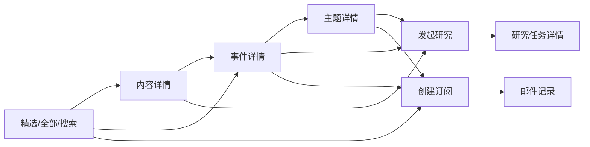

# AI Hotspot 产品信息架构

> 文档状态：M0 冻结候选

## 1. 设计目标

信息架构需要同时服务三种不同心智：

1. 普通用户想快速浏览和发现内容；
2. 研究用户想搜索、提问和生成报告；
3. 运营人员想维护信源、处理异常和治理内容。

三类任务不能全部塞入同一个侧边栏。正式产品采用“用户工作区”和“管理工作区”分离，研究与自动化作为用户工作区中的高级能力。

## 2. 顶层工作区

```text
AI Hotspot
├── 用户工作区
│   ├── 内容发现
│   ├── 知识研究
│   ├── 自动化
│   └── 个人空间
└── 管理工作区
    ├── 运营概览
    ├── 信源与采集
    ├── 内容与事件
    ├── 报告与推送
    └── 系统治理
```

用户只有具备 ADMIN 或 OPERATOR 等对应角色时才能看到“进入管理工作区”。管理工作区提供返回用户端的明确入口。

## 3. 用户工作区导航

### 3.1 内容发现

| 导航 | 建议路由 | 核心对象 |
|---|---|---|
| 精选 | `/` | 精选内容、热点事件 |
| 全部动态 | `/动态` | 内容条目 |
| 热点 | `/热点` | 事件 |
| AI 日报 | `/日报` | 报告 |
| 主题 | `/主题` | 主题、实体 |
| 搜索 | `/搜索` | 内容、事件、主题、实体 |

正式代码可使用稳定英文路由，但产品方案和页面名称使用中文。最终路由形式将在前端详细设计中确认。

### 3.2 知识研究

| 导航 | 建议路由 | 核心对象 |
|---|---|---|
| 知识问答 | `/研究/问答` | 对话、消息、引用 |
| 研究任务 | `/研究` | 研究任务、报告 |
| 研究记录 | `/研究/记录` | 已保存研究 |

### 3.3 自动化

| 导航 | 建议路由 | 核心对象 |
|---|---|---|
| Agent 工作台 | `/自动化/Agent` | Agent 模板和运行 |
| 我的订阅 | `/自动化/订阅` | 订阅规则 |
| 邮件记录 | `/自动化/邮件` | 邮件投递 |

### 3.4 个人空间

- 收藏；
- 已读和稍后阅读；
- 个人设置；
- 邮件订阅偏好与退订状态；MVP 不提供用户自带模型 API Key。
- 纠错与下架反馈记录。

## 4. 管理工作区导航

### 4.1 运营概览

- 今日新增内容；
- 采集成功率；
- 待审核数量；
- 热点和日报状态；
- AI 成本；
- 邮件投递；
- Agent 等待审批；
- 系统告警。
- 失败任务和死信任务。

### 4.2 信源与采集

| 页面 | 主要能力 |
|---|---|
| 信源列表 | 主体、入口、状态、来源等级、健康度 |
| 信源详情 | 配置、入口、采集历史、内容策略和审计 |
| 新增信源 | URL 检测、查重、试抓取、推荐配置和确认 |
| 采集监控 | 任务、结果、耗时、失败、重试和积压 |
| 采集任务详情 | 请求、原始响应、游标、错误、Trace 和重试 |

### 4.3 内容与事件

| 页面 | 主要能力 |
|---|---|
| 内容审核队列 | 低置信度、低相关、精选候选和版权异常 |
| 内容编辑 | 标题、摘要、标签、实体、评分和可见性 |
| 事件审核队列 | 聚类冲突、跨事件关联、合并和拆分 |
| 事件编辑 | 主条目、成员、关系、时间线和状态 |

### 4.4 报告与推送

- 日报列表；
- 日报编辑；
- 预览和发布；
- 订阅运行；
- 邮件模板；
- 投递日志。
- 一键退订和偏好状态。

### 4.5 系统治理

- 用户与角色；
- 模型路由；
- Prompt 版本；
- AI 评测；
- Agent 运行；
- 审批中心；
- 审计日志；
- 系统设置；
- 系统健康。
- 失败任务重放；
- 邀请码和公开注册开关。

## 5. 核心对象详情页

### 5.1 内容详情

主要展示单篇材料：

- 来源与发布时间；
- 原标题和中文标题；
- AI 摘要；
- 推荐理由；
- 分类、主题、实体和标签；
- 内容策略；
- 可公开正文或摘要提示；
- 关联事件；
- 原文入口；
- 收藏和发起研究。

### 5.2 事件详情

主要展示现实事件：

- 事件标题和摘要；
- 主条目；
- 独立信源数量；
- 事件起止时间和最后更新；
- 来源时间线；
- 官方、研究、报道、观点和重复关系；
- 跨事件关联提示；
- 相关主题和实体；
- 基于事件提问、订阅或生成报告。

### 5.3 主题详情

- 主题定义；
- 趋势和内容量；
- 近期热点事件；
- 精选内容；
- 主要实体；
- 来源分布；
- 订阅和研究入口。

### 5.4 研究任务详情

- 用户目标；
- 查询理解；
- 过滤范围；
- 检索和重排序状态；
- 证据；
- 结论和引用；
- 模型、耗时和费用；
- 继续研究或导出。

### 5.5 Agent 运行详情

- 目标和调用者；
- 运行状态；
- 计划；
- 步骤；
- 工具和参数；
- 审批；
- 结果；
- 错误、重试和取消；
- Token、费用和 Trace。

## 6. 页面入口关系



## 7. 权限层级

### 游客无需登录的页面

- 精选、全部公开动态、日报、主题、公开内容详情、公开事件详情和公开搜索。

### 需要登录的页面

- 收藏；
- 订阅；
- 邮件记录；
- 知识问答；
- 研究记录；
- 个人 Agent 任务。

账号由管理员创建或通过邀请码注册；公众自由注册在 MVP 中关闭。

### 需要编辑或运营权限的页面

- 内容审核；
- 事件审核；
- 信源和采集管理；
- 日报编辑。

### 需要管理员权限的页面

- 用户和角色；
- 模型和 Prompt 发布；
- Agent 高风险审批；
- 全站推送；
- 审计和系统设置。

## 8. 导航设计原则

1. 首页始终是精选，而不是后台仪表盘或聊天页；
2. 热点、内容和事件具有不同入口；
3. 搜索是全局能力，不只存在于精选页；
4. 研究入口应在内容、事件和主题上下文中随处可达；
5. 订阅入口应允许继承当前主题、事件或搜索条件；
6. 管理功能不污染普通用户导航；
7. 移动端使用收起导航、抽屉筛选和单栏证据展示；
8. 页面返回应保持原筛选、日期和滚动位置。

## 9. 配套详细设计

本信息架构已经由以下文档具体化：

- 《导航路由与页面功能详细规格》；
- 《页面状态交互与组件规范》；
- 《正式原型构建与验收记录》；
- `AI_HOTSPOT_PROTOTYPE.html`。

正式 Next.js 实现安排在 M1 及后续里程碑，必须继承这些页面与状态合同。
