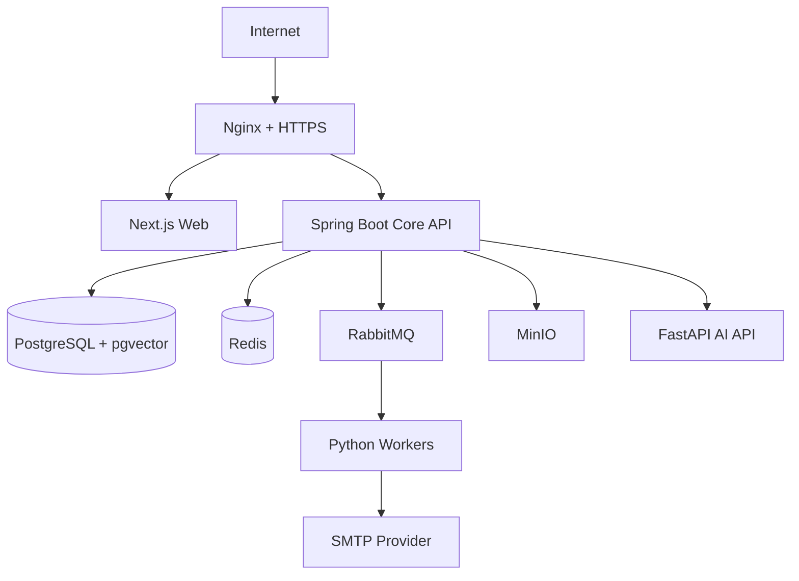

# AI Hotspot 本地与部署架构

> 文档状态：已确认

## 1. 标准开发环境

- Windows 10/11；
- Docker Desktop；
- WSL2；
- Docker Compose；
- 4 核 CPU 以上；
- 16GB RAM 最低，32GB 更合适；
- 至少 40GB 可用空间；
- 独立显卡非必须。

Docker Compose 是唯一标准运行方式。PowerShell 只封装 Compose 命令，不维护一套 Windows 原生服务安装方案。

## 2. Compose 服务清单

```text
web
core-api
ai-api
crawl-worker
content-worker
embedding-worker
cluster-worker
report-worker
notification-worker
agent-worker
postgres
redis
rabbitmq
minio
mailpit
```

多个 Python Worker 共用一个镜像，通过不同命令和队列绑定运行。

## 3. 建议 Compose Profile

### 基础设施 `infra`

- postgres；
- redis；
- rabbitmq；
- minio；
- mailpit。

### 核心应用 `core`

- web；
- core-api；
- ai-api。

### 标准 Worker `workers`

- crawl-worker；
- content-worker；
- embedding-worker；
- cluster-worker；
- report-worker；
- notification-worker；
- agent-worker。

开发者可以只启动当前需要的 Worker，但完整验收必须启动全部服务。

## 4. 端口暴露原则

- Web 和 Core API 对宿主机开放开发端口；
- PostgreSQL、Redis、RabbitMQ、MinIO 和 Mailpit 可在开发模式开放受控端口；
- Beta 环境仅 Nginx 暴露 80/443；
- RabbitMQ Management、MinIO Console、数据库端口不得直接暴露公网；
- AI API 默认仅在内部 Docker 网络访问。

具体端口在 Compose 方案中统一配置，避免在业务代码硬编码。

## 5. 数据卷

至少包含：

- PostgreSQL 数据；
- RabbitMQ 数据；
- MinIO 对象；
- Redis 数据（即使核心状态不依赖 Redis，也保留开发恢复能力）；
- 可选模型缓存。

`dev-reset` 属于破坏性操作，必须明确提示将删除哪些卷，并提供不删除数据的普通停止命令。

## 6. 环境配置

建议提供：

```text
.env.example
docker-compose.yml
compose.override.yml（可选本地覆盖）
scripts/dev-up.ps1
scripts/dev-down.ps1
scripts/dev-reset.ps1
scripts/dev-logs.ps1
scripts/dev-status.ps1
```

环境变量类别：

- 数据库；
- Redis；
- RabbitMQ；
- MinIO；
- Mailpit/SMTP；
- Session/JWT；
- DeepSeek；
- Embedding/Rerank；
- 服务 URL；
- 日志和 Trace；
- 内容阈值和任务并发。

## 7. 启动依赖与健康检查

- PostgreSQL、RabbitMQ、Redis、MinIO 先通过健康检查；
- Core API 完成数据库迁移后就绪；
- AI API 验证 Provider 配置，无 Key 时使用 Mock 模式；
- Worker 只有在 RabbitMQ 与数据库可用后启动消费；
- Web 在 Core API 可访问后就绪；
- “容器启动”不等于“应用健康”。

## 8. 资源控制

- 每个 Worker 设置合理 CPU/内存和并发；
- Embedding/Rerank 本地运行时可使用单独 Profile；
- 16GB 环境默认降低 Worker 并发，不并行加载不必要模型；
- RabbitMQ Prefetch 防止单 Worker 拉取过多任务；
- MinIO 图片缓存和原始文件设置清理策略；
- Docker 日志设置轮转上限。

## 9. 本地邮件

开发环境邮件统一发送到 Mailpit：

- 不向真实外部地址发送；
- 可查看 HTML、纯文本、退订链接和邮件头；
- Notification Worker 仍走完整 RabbitMQ 流程；
- SMTP Provider 切换不能改变业务层接口。

## 10. 邀请制 Beta 部署



初始部署：

- 单台 Linux 云服务器；
- Docker Compose；
- Nginx；
- HTTPS；
- 邀请制账号；
- 数据卷和定期备份。

## 11. Beta 上线前检查

- 云服务器规格；
- 域名和 HTTPS；
- 备案和内容合规；
- 数据存储地区；
- 真实 SMTP；
- MinIO 或兼容 S3 对象存储；
- PostgreSQL 与 MinIO 备份；
- 隐私政策、用户协议、纠错和下架流程；
- 管理端、RabbitMQ Management 和 MinIO Console 网络隔离；
- 密钥轮换和恢复演练。

## 12. 不在第一版使用

- Kubernetes；
- Kafka；
- Elasticsearch/OpenSearch 集群；
- 多节点数据库；
- 多区域部署；
- 云厂商专有绑定。
