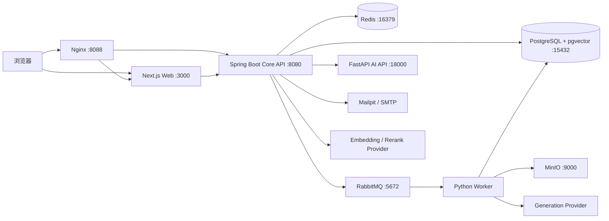

# AI Hotspot 系统总体架构

> 文档状态：现行、唯一总体架构
> 更新时间：2026-07-22；以当前代码、`compose.yaml` 和 Flyway 为准。

## 1. 架构结论

AI Hotspot 采用“**三套应用代码、十个 Compose 服务、一个 PostgreSQL 业务数据库**”的模块化单机架构：

- `apps/web`：Next.js Web，承载公开端、普通用户智能端和管理端；
- `services/core`：Spring Boot Core API，承载认证、权限、业务状态机、RAG 编排、审计和运维门禁；
- `services/ai`：FastAPI AI API 与同代码库 Python Worker，承载采集、内容分析和模型适配；
- PostgreSQL + pgvector 是业务事实和检索索引的权威存储；
- RabbitMQ 负责可靠异步任务；Redis 负责 Session、缓存、限流和短期协调；MinIO 保存原始证据；
- Docker Compose 是开发和初始生产部署的唯一标准方式。

项目不拆成大量微服务，不引入 Kubernetes、Kafka、Elasticsearch 或多数据库，以降低个人项目的部署、调试和运维成本。

## 2. 当前运行拓扑



实际 Compose 服务共 10 个：`web`、`core-api`、`ai-api`、`worker`、`postgres`、`redis`、`rabbitmq`、`minio`、`mailpit`、`nginx`。一个 Worker 进程消费多个业务队列，不为每种任务复制一个容器；出现独立扩容需求后再按队列横向增加相同 Worker 实例。

## 3. 应用职责与禁止越界

| 应用 | 当前主责 | 不允许承担 |
|---|---|---|
| Web | 路由、SSR/客户端交互、公开内容、注册登录、收藏、订阅、研究、Agent、管理页面 | 直连数据库、保存模型密钥、仅靠隐藏按钮鉴权 |
| Core API | Session/CSRF/RBAC、信源配置、内容治理、公开查询、主题报告、收藏订阅、RAG 检索编排、Agent 审批、审计、Outbox、就绪检查 | 批量抓取网页、绕过队列执行长采集任务 |
| AI API | Provider 健康与统一适配、同步内容分析/Embedding/Rerank 能力 | 接受前端绕过 Core 的私有数据请求、决定用户权限 |
| Worker | Connector、原件入 MinIO、标准化、内容分析、评分、主题持久化、队列幂等和失败处理 | 绕过公开准入触发器、直接授予权限或批准高风险操作 |

Core 代码按 `auth/source/crawl/content/knowledge/subscription/notification/agent/operations` 等业务模块组织。AI 代码按 `connectors/pipeline/content_analysis/repository/storage/worker` 组织。当前规模不再增加无实际边界价值的层级和空模块。

## 4. 核心业务数据流

### 4.1 资讯采集与发布

```text
SourceEndpoint 到期
→ Core 创建 FetchJob + OutboxEvent（同一事务）
→ RabbitMQ 投递 source.crawl.requested
→ Worker 抓取 RSS/网站/API 并把原件写入 MinIO
→ RawEntry 与 ContentItem 幂等落库
→ 真实 Generation Provider 生成中文标题、摘要、评分、标签和推荐理由
→ URL/内容去重、主题与事件关联
→ 数据库准入规则决定 PUBLISHED + PUBLIC
→ 公开流、主题、报告、订阅与知识索引读取同一内容事实
```

关键约束：无匹配关键词是一次成功的空采集，不应制造死信；Mock/Test/Fixture Provider 永远不能进入公开产品或 RAG。

### 4.2 RAG

```text
登录用户问题
→ Core 先计算 PUBLIC/PRIVATE_RAG 权限范围
→ 解析时间、主题和官方来源意图
→ PostgreSQL FTS + bge-m3 向量并行召回
→ RRF 融合 + bge-reranker-v2-m3 重排
→ 来源/事件多样化与时效过滤
→ DeepSeek 基于证据生成
→ 逐句引用覆盖检查与修复
→ 不满足证据门槛时降级为引用式证据摘录或 NO_EVIDENCE
→ QueryRun、Citation、延迟、覆盖率和信源数落库
```

权限过滤必须发生在检索前。回答不能引用用户无权访问的 Chunk，也不能用模型训练记忆补齐缺失事实。

### 4.3 注册、邮件与 Agent

- 普通用户使用邮箱验证码注册或登录；管理员账号由本地环境引导创建。
- 每日/每周订阅由 Core 生成运行记录，邮件通过 MailProvider 发送，本地进入 Mailpit。
- Agent 继承当前用户权限；L2/L3 写操作必须进入审批，步骤、工具参数指纹、结果和错误均可审计。

## 5. 存储与权威边界

| 组件 | 保存内容 | 不保存内容 |
|---|---|---|
| PostgreSQL | 用户、权限、信源、任务、内容、主题事件、报告、订阅、Agent、审计、FTS、向量、引用 | 大型原始网页与二进制附件 |
| MinIO | 原始 RSS/HTML/JSON、快照、图片与导出物 | 业务状态与权限裁决 |
| Redis | Session、限流、缓存、短期锁 | 不可丢失的业务事实和核心队列 |
| RabbitMQ | 异步任务、重试、死信 | 长期业务记录；最终状态仍写 PostgreSQL |
| Mailpit/SMTP | 开发邮件捕获或生产发送 | 订阅权威状态 |

## 6. 数据库组织

当前 PostgreSQL 按领域使用 8 个 Schema：

```text
iam          身份、角色、权限、验证码
source       信源、Endpoint、采集任务、原始条目
content      内容、标签、主题、事件、报告
knowledge    数据集、文档、Chunk、向量、Provider、评测
research     RAG 查询、引用和研究运行
automation   订阅、邮件、Agent、审批和工具调用
messaging    Outbox、Inbox、死信
governance   工单、保留策略、发布就绪和审计性治理
```

详细字段只在《数据库表全景与字段中文说明》中维护，本文不重复字段字典。

## 7. 同步、异步与事务规则

- 浏览、登录、配置、审批、公开搜索和普通 RAG 走同步 HTTP；
- 采集、批量分析、索引重建、报告、邮件和长 Agent 走 RabbitMQ；
- Core 的业务写入与 Outbox 写入必须同一事务提交；
- Worker 使用 Inbox/幂等键避免重复副作用；
- 失败任务允许重试，超过次数进入死信；端点后来成功或归档后，旧死信标记为 `IGNORED` 但不删除审计；
- Flyway 是唯一 Schema 变更入口，Hibernate 只做校验。

## 8. 安全边界

- Session 存 Redis，修改请求使用 CSRF；密码使用 BCrypt；验证码只存带 Pepper 的摘要；
- ADMIN/OPERATOR 才能修改信源和治理配置；普通用户只能操作自己的收藏、订阅、研究和 Agent；
- 采集 URL 受协议、端口、DNS、内网地址和重定向约束，避免 SSRF；
- 模型密钥只来自服务端环境变量/加密配置，不进入浏览器、Git、日志或方案；
- `display_policy` 与 `index_policy` 独立，允许展示摘要但禁止全文索引；
- PRIVATE_RAG 权限在召回 SQL 之前生效。

## 9. 当前简化决策

为降低冗余，以下能力明确不在当前架构中重复建设：

- 不创建第二套原生 Windows 部署流程；
- 不为每个 Python 队列维护一套代码或镜像；
- 不在 Web、Core、AI 三处各自实现一套权限判断；Core 是最终裁决者；
- 不同时维护 PostgreSQL FTS 和 Elasticsearch；
- 不引入 LangGraph，除非 Agent 出现确切的持久化图编排需求；当前数据库状态机和 Worker 足够；
- X 只保留禁用契约，不采集；微信公众号不在范围。

## 10. 部署演进

当前开发：Windows + Docker Desktop + WSL2 + Docker Compose。
初始 Beta：单台 Linux + Docker Compose + Nginx + HTTPS，数据库和对象存储使用持久卷与定期备份。

只有出现经过测量的瓶颈后才考虑：拆分 Worker、托管 PostgreSQL/对象存储、独立检索服务或多机部署。架构演进必须通过 ADR，不以“未来可能需要”为由提前增加组件。

## 11. 架构验收标准

1. 10 个 Compose 服务可启动，关键服务健康；
2. Web 只通过 Core API 读取业务数据；
3. 公开内容不存在 Mock Provider，来源时间异常可监控；
4. 异步任务可幂等、重试、死信和审计；
5. RAG 无 ACL 泄漏且重要结论带真实引用；
6. PostgreSQL 与 MinIO 可备份并在隔离环境恢复；
7. M10 就绪检查失败时不得宣称 Beta 就绪。
