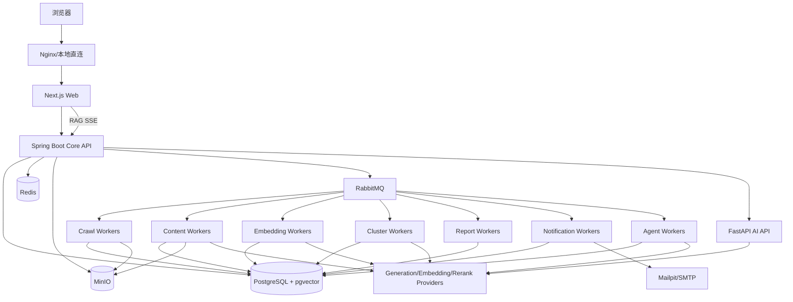

# AI Hotspot 系统总体架构

> 文档状态：M0 冻结候选
> 本文落实已确认的模块化三端架构和 RabbitMQ 可靠异步方案。

## 1. 架构目标

- 在 Windows + Docker Compose 环境完整运行；
- 支撑资讯、运营、RAG、邮件和 Agent 的真实闭环；
- 将确定性业务、安全边界与快速演进的 AI 处理分离；
- 保留原始证据和全链路追踪；
- 所有长任务可重试、可幂等、可死信、可人工重放；
- MVP 后可平滑部署到单台 Linux 云服务器；
- 不提前引入 Kubernetes、Kafka、Elasticsearch 或大量微服务。

## 2. 总体结构



## 3. 容器级职责

### 3.1 Next.js Web

负责：

- 用户端与管理端页面；
- 服务端渲染公开资讯；
- 中文 UI 和 i18n Key 结构；
- TanStack Query 客户端状态；
- 表单、筛选、审批和后台交互；
- SSE 流式展示；
- 页面权限体验，但不替代服务端鉴权。

不负责：

- 直接访问数据库；
- 保存模型密钥；
- 执行采集或长时间 AI 任务；
- 仅靠隐藏按钮实现权限控制。

### 3.2 Spring Boot Core API

负责确定性业务和安全边界：

- 邀请制账号、认证、角色和权限；
- SourceEntity、SourceEndpoint 和配置；
- 内容查询、准入、审核、发布、下架和恢复；
- 事件、主题、标签和实体管理；
- 收藏、订阅、报告和邮件业务；
- 管理后台 API；
- Agent 工具授权和高风险审批；
- 审计日志；
- OpenAPI；
- Transactional Outbox；
- 任务状态与失败重放入口。

不直接负责：

- 批量采集；
- 正文抽取；
- LLM 摘要和分类；
- Embedding 与 Rerank；
- 事件语义判断；
- 长时间 Agent 任务。

### 3.3 FastAPI AI API

负责需要同步调用的智能能力：

- 普通 RAG 问答编排；
- Query Understanding；
- 检索、Rerank 和引用验证；
- 少量信源试抓取预览；
- AI 能力健康检查；
- 模型 Provider 统一适配。

普通 RAG 通过 Core API 统一鉴权和构建权限过滤，再使用 HTTP + SSE 返回。FastAPI 不接受前端绕过 Core API 的未授权调用。

### 3.4 Python Workers

同一 Python 代码仓库、同一基础镜像，通过不同启动命令运行：

- Crawl Worker；
- Content Worker；
- Embedding Worker；
- Cluster Worker；
- Report Worker；
- Notification Worker；
- Agent Worker。

Worker 通过 RabbitMQ 获得任务，使用 Consumer Inbox 保证幂等，更新数据库任务状态并发布后续事件。

## 4. 存储职责

### PostgreSQL + pgvector

- 核心业务数据和状态；
- 全文搜索；
- KnowledgeChunk 向量；
- 语义去重和事件候选向量；
- Outbox、Inbox、审计和任务历史。

### Redis

- 缓存；
- 分布式锁；
- API 限流；
- 调度锁；
- 热点缓存；
- 临时会话和 SSE 状态；
- 短生命周期幂等辅助数据。

Redis 不承担核心可靠异步任务，不使用 Redis List/Streams 替代 RabbitMQ。

### RabbitMQ

- 可靠异步任务分发；
- Java 与 Python 解耦；
- 削峰；
- 延迟重试；
- 死信；
- Worker 横向扩展。

### MinIO

- 原始 HTML、RSS XML、JSON；
- 页面快照；
- 图片缓存；
- 导出报告；
- 管理员授权上传资料；
- 处理失败追溯文件。

数据库只保存 Object Key、Hash、MIME、大小、权限和时间等元数据。

## 5. 同步与异步边界

### 同步 HTTP

- 登录、邀请和权限查询；
- 公开资讯、详情和搜索；
- 收藏和订阅配置；
- 信源配置修改；
- 少量试抓取预览；
- 普通 RAG + SSE；
- 任务状态查询；
- 管理员审批。

### RabbitMQ 异步

- 定时和批量采集；
- 内容清洗和 AI 加工；
- Embedding；
- 语义去重和事件聚类；
- 日报、周报；
- 邮件发送；
- 深度研究；
- Agent 长任务；
- 历史数据重新处理；
- 批量评分和重新索引。

管理员触发异步任务时：

```text
API 创建 Job 和 OutboxEvent
→ 事务提交
→ Outbox Publisher 发布 RabbitMQ
→ Worker 执行并更新 Job
→ 前端轮询或 SSE 查看状态
```

## 6. 数据访问原则

- Core API 是用户、权限、发布、审批和审计的最终权威；
- Python 可以访问其负责的处理表和任务表，但不能绕过发布和权限规则；
- 前端不直接访问 PostgreSQL、Redis、RabbitMQ 或 MinIO 管理接口；
- 对象下载通过受控 API 或短期签名 URL；
- 模型密钥只在服务端 Provider 配置中使用；
- 所有跨服务操作携带 correlationId 和 traceId。

## 7. 模块化而非微服务化

MVP 只有三个代码应用边界：

1. Web；
2. Core API；
3. AI/Worker 代码库。

多个 Worker 是同一 Python 应用的不同进程，不是多个独立业务微服务。只有出现独立扩缩容、权限、发布节奏或可靠性要求时，才评估进一步拆分。

## 8. 不采用的架构

- 不使用 Kafka；
- 不使用 Redis Streams 作为核心队列；
- 不使用 Kubernetes；
- 不使用 Elasticsearch/OpenSearch；
- 不使用多节点 PostgreSQL；
- 不使用多区域部署；
- 不使用大量数据库按服务拆分。

## 9. 架构验收

- 所有容器可通过 Docker Compose 启动并健康；
- 公开页面只调用 Core API；
- 普通 RAG 可 SSE 返回；
- 异步链路通过 RabbitMQ 工作；
- 数据库事务与消息发布不存在丢事件窗口；
- 重复消息不产生重复副作用；
- 失败消息可进入死信并人工重放；
- 从页面请求可以通过 traceId 追踪到任务、Worker 和模型运行。
