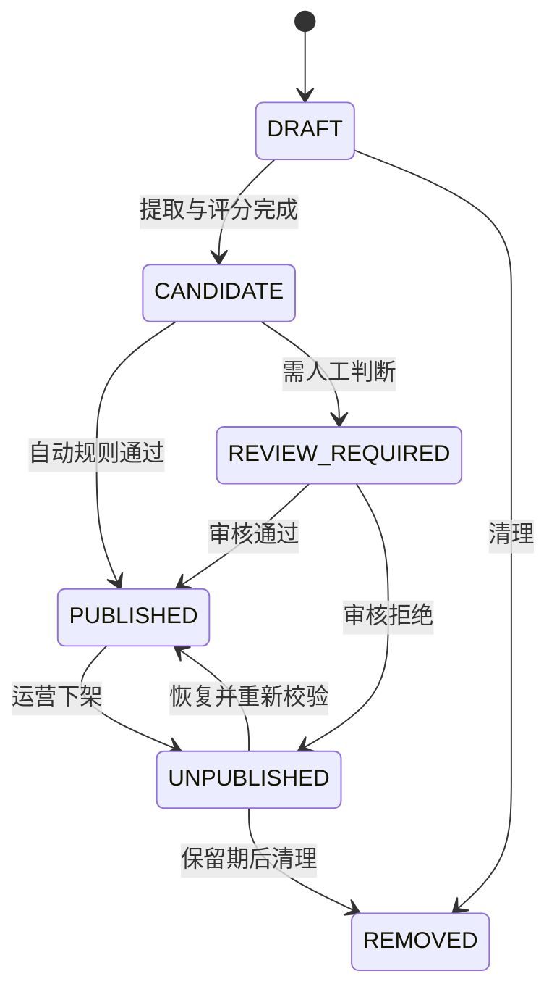
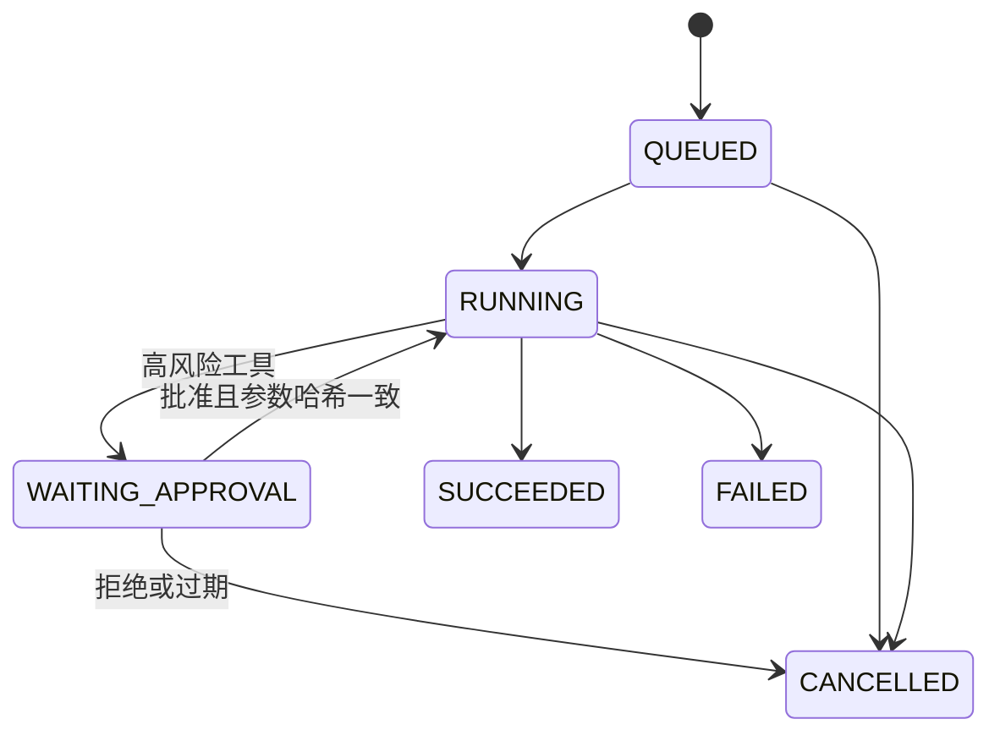

# AI Hotspot 业务状态机与领域不变量

> 文档状态：M0 冻结候选。状态转换只能通过领域命令执行，禁止控制器直接改状态字段。

## 1. 内容处理与发布



发布不变量：Endpoint 启用；提取成功；默认 relevance≥70、quality≥60；不是重复从条目；display_policy 允许；`DEBUNKED` 不发布；自动规则通过或有审核记录。阈值来自版本化配置，发布时保存快照。

`UNCONFIRMED` 只允许可信来源，强制展示标记，默认 `featured=false`；转为 `DEBUNKED` 时立即从默认查询和向量索引移除。恢复发布必须重新执行策略与阈值检查。

## 2. 事实状态

```text
CONFIRMED → UNCONFIRMED  （证据受到实质质疑）
UNCONFIRMED → CONFIRMED  （获得官方或多源证实）
CONFIRMED/UNCONFIRMED → DEBUNKED（获得可靠证伪）
DEBUNKED → UNCONFIRMED/CONFIRMED（仅管理员，必须给出新证据与审计）
```

事实状态与发布状态独立；任何转换都触发精选重算、事件聚合更新和索引策略重算。

## 3. 事件聚类

事件状态：`OPEN → STABLE → ARCHIVED`，可在新证据出现时由 STABLE/ARCHIVED 回到 OPEN。内容和事件为多对多；一个事件只有一个主条目，但一篇内容可作为不同事件的成员。

合并创建 `merged_into_id` 并迁移关系；拆分创建新事件并保留来源关系历史。跨事件关联存 `RELATED/CAUSES/FOLLOWS/CONTRADICTS/SAME_SERIES`，不能用普通标签替代，也不能自动形成同一事件。

## 4. 信源与采集

Endpoint：`DRAFT → ACTIVE ↔ PAUSED → ARCHIVED`。只有 ADMIN/OPERATOR 可转换。激活前必须通过 URL 安全校验、唯一性、Connector 配置 Schema 和试抓取。

Fetch Job：`QUEUED → RUNNING → SUCCEEDED`；可进入 `WAITING_RETRY → QUEUED`，超过上限进入 `DEAD_LETTERED`；未开始可 `CANCELLED`。任务成功不等于内容公开。

## 5. 订阅与投递

Subscription：`DRAFT → ACTIVE ↔ PAUSED → UNSUBSCRIBED`。退订是终态；重新启用创建新订阅或明确重新订阅记录。每个订阅和时间窗口只有一个 Run；每个 Run 与收件人只有一个 message_key。

Delivery：`PENDING → SENDING → SENT`，临时失败进入 `RETRY_WAIT`，超过上限 `FAILED`。一键退订立即阻止未来发送，已经排队的任务在发送前二次校验。

## 6. Agent 与审批



Agent 继承发起用户的权限快照，但每次工具执行仍按当前权限复核。审批只对工具名、规范化参数哈希、对象版本和有效期生效；参数变化、对象变化或权限降低使审批失效。Agent 不能创建高于发起人的权限。

## 7. 反馈与内容治理

Ticket：`OPEN → TRIAGED → IN_PROGRESS → RESOLVED/REJECTED → CLOSED`，可重新打开。下架、恢复、驳回均保存理由、证据、操作者与前后状态。版权类工单可先紧急下架再复核。

## 8. 系统级不变量

1. `display_policy` 与 `index_policy` 永不互相推导，必须分别决定。
2. 权限过滤在全文/向量召回前完成，不能检索后再遮挡。
3. 外部正文和二进制不进入消息体，只传 ID/Object Key。
4. 所有副作用可幂等；业务事务与 Outbox 同事务。
5. 任何公开对象均能追溯来源、处理版本、发布者和策略快照。
6. 物理删除不先于公开下架、索引清理和审计固化。
7. 时间存 UTC，计划任务按订阅时区解释。

