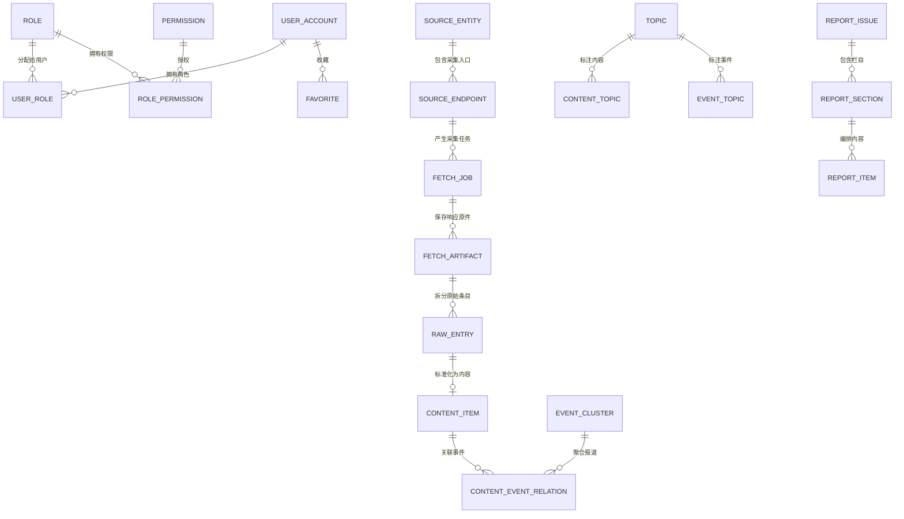

# AI Hotspot 数据库表全景与字段中文说明

> 基准日期：2026-07-25
> 当前阶段：M10 本地交付后的信源质量与 RAG 专项（Flyway V001～V037）
> 数据库：PostgreSQL 16 + pgvector 0.8.5
> 本文只把已经由迁移创建的对象称为“现有表”。2026-07-25 实时核对已执行到 V037，M7～M10、RAG 阶段 B、信源质量周报、发布时间来源、Connector 轮询结果与回答反馈对象均为现有结构。

## 1. 如何阅读字段

- `UUID`：全局唯一编号；业务关联使用编号，不依赖容易变化的名称。
- `TIMESTAMPTZ`：带时区时间，数据库统一存 UTC，界面按 `Asia/Shanghai` 展示。
- `JSONB`：可查询的结构化扩展数据；只用于可变配置、快照和模型结果。
- `TSVECTOR`：PostgreSQL 全文检索索引文本，不直接展示给用户。
- `version`：乐观锁版本号；编辑时防止后提交的人覆盖先提交的人。
- `created_at / updated_at`：创建时间 / 最后更新时间。下文重复字段仍会列出，但含义相同。

## 2. 当前数据库全景

当前共有 **57 张业务表**：`iam` 7 张、`source` 6 张、`content` 13 张、`governance` 4 张、`messaging` 3 张、`knowledge` 10 张、`research` 5 张、`automation` 9 张。数量以 `information_schema.tables` 的 `BASE TABLE` 实时核对为准。

## 3. `iam`：用户、登录、角色与权限（7 张）

### 3.1 `iam.user_account`（用户账号）

| 字段 | 中文含义 |
|---|---|
| `id` | 用户唯一编号，主键 |
| `email` | 登录邮箱，忽略大小写且全局唯一 |
| `display_name` | 用户显示名称 |
| `password_hash` | 密码哈希；邮箱验证码用户可以为空，绝不保存明文密码 |
| `status` | 账号状态：邀请中、正常、停用或删除 |
| `locale` | 用户语言偏好，当前默认 `zh-CN` |
| `timezone` | 用户时区，默认 `Asia/Shanghai` |
| `version` | 乐观锁版本号 |
| `created_by` | 创建此账号的用户；公开注册时可为空 |
| `created_at` / `updated_at` | 创建时间 / 更新时间 |
| `last_login_at` | 最近一次成功登录时间 |

### 3.2 `iam.email_verification_challenge`（邮箱验证码挑战）

| 字段 | 中文含义 |
|---|---|
| `id` | 验证码请求唯一编号 |
| `email` | 接收验证码的邮箱 |
| `purpose` | 用途：`REGISTER` 注册或 `LOGIN` 登录 |
| `code_hash` | 验证码加盐摘要，不保存六位明文 |
| `expires_at` | 失效时间 |
| `consumed_at` | 成功使用时间；非空表示不能再次使用 |
| `failed_attempts` / `max_attempts` | 已失败次数 / 最大允许次数 |
| `requested_ip_hash` | 请求 IP 的不可逆摘要，用于反滥用 |
| `created_at` | 请求时间 |

### 3.3 `iam.invitation_code`（兼容保留的邀请码）

| 字段 | 中文含义 |
|---|---|
| `id` | 邀请码记录编号 |
| `code_hash` | 邀请码摘要，不保存明文 |
| `created_by` | 创建邀请码的管理员 |
| `default_role` | 使用后默认赋予的角色 |
| `max_uses` / `used_count` | 最大次数 / 已使用次数 |
| `expires_at` | 到期时间 |
| `status` | 可用、用尽、过期或撤销 |
| `version` | 并发更新版本号 |
| `created_at` | 创建时间 |

公开注册已经开放，此表只服务管理员定向邀请、测试或未来特殊角色发放，不再限制普通用户注册。

### 3.4～3.7 权限四表

| 表 | 字段及中文含义 |
|---|---|
| `iam.role` | `id` 角色编号；`code` 程序角色码；`display_name` 中文名称；`builtin` 是否内置；`created_at` 创建时间 |
| `iam.permission` | `id` 权限编号；`code` 权限码，如 `report:manage`；`description` 中文说明；`created_at` 创建时间 |
| `iam.user_role` | `user_id` 用户；`role_id` 角色；`assigned_by` 分配人；`assigned_at` 分配时间；用户与角色组成联合主键 |
| `iam.role_permission` | `role_id` 角色；`permission_id` 权限；两字段组成联合主键 |

普通注册固定获得 `USER`；管理端需要 `OPERATOR` 或 `ADMIN` 及具体权限，不能靠前端隐藏按钮代替后端授权。

## 4. `source`：信源、采集、原始数据与质量治理（6 张）

### 4.1 `source.source_entity`（信源主体）

| 字段 | 中文含义 |
|---|---|
| `id` | 信源主体编号 |
| `name` / `slug` | 展示名称 / 稳定网址标识 |
| `entity_type` | 主体类型，如公司、研究机构、媒体或社区 |
| `country_code` | 国家或地区代码 |
| `official_level` | 官方等级：官方、一手、权威媒体、社区等 |
| `authority_score` | 权威分，用于质量评分 |
| `website_url` / `logo_url` | 官方主页 / Logo 地址 |
| `status` | 草稿、启用、暂停或归档 |
| `version` | 乐观锁版本 |
| `created_by` | 创建者 |
| `created_at` / `updated_at` | 创建 / 更新时间 |

### 4.2 `source.source_endpoint`（可采集入口）

| 字段 | 中文含义 |
|---|---|
| `id` / `source_entity_id` | 入口编号 / 所属信源主体 |
| `name` | 入口名称，如“OpenAI News RSS” |
| `url` / `normalized_url` | 原始地址 / 规范化去重地址 |
| `endpoint_type` | 入口类型：RSS、Atom、Sitemap、GitHub、arXiv 等 |
| `connector_type` | 实际使用的采集适配器 |
| `language` | 主要内容语言 |
| `polling_interval_seconds` | 轮询间隔秒数 |
| `display_policy` | 前台可展示范围策略 |
| `index_policy` | 能否进入全文/向量索引的策略；与展示策略分离 |
| `authority_override` | 对主体权威分的入口级覆盖值 |
| `config` | Connector 的结构化配置 |
| `credential_ref` | 凭据引用，不保存密钥明文 |
| `status` / `health_status` | 业务状态 / 健康状态 |
| `last_success_at` / `last_failure_at` | 最近成功 / 失败时间 |
| `failure_count` | 连续失败次数 |
| `last_probe_status` / `last_probe_latency_ms` | 最近探测 HTTP 状态 / 延迟毫秒 |
| `version` / `created_by` | 并发版本 / 创建者 |
| `created_at` / `updated_at` | 创建 / 更新时间 |
| `next_fetch_at` | 下次计划采集时间 |
| `last_etag` / `last_modified` / `last_content_hash` | 增量抓取缓存标识 |
| `last_fetch_item_count` / `last_fetch_job_id` | 最近抓到的条数 / 最近任务编号 |
| `catalog_kind` / `catalog_key` | 正式、测试或保留目录类型 / 目录稳定键 |
| `quality_weight` | 质量权重，默认 1；连续周低质第三方来源可自动降至 0.75 或 0.50 |
| `quality_state` / `quality_reason` | 质量治理状态 / 最近评估与动作原因 |
| `quality_evaluated_at` | 最近一次周度质量评估时间 |
| `last_poll_outcome` | 最近一次轮询业务结果：从未轮询、新增、正常零新增、HTTP 304、上游失败、内容失败或取消 |
| `consecutive_no_change_count` | 连续健康无变化次数；零新增或 304 递增，新增或失败时归零 |

X 目前只保留 `RESERVED` 扩展契约，不启用、不调度、不采集；这与当前产品范围一致。

### 4.3 `source.fetch_job`（一次采集任务）

| 字段 | 中文含义 |
|---|---|
| `id` / `endpoint_id` | 任务编号 / 目标入口 |
| `trigger_type` | 触发方式：定时、手动、探测、重试等 |
| `scheduled_window` | 所属调度时间窗 |
| `idempotency_key` | 幂等键，避免同一时间窗重复任务 |
| `status` | 排队、运行、成功、等待重试、失败或死信 |
| `poll_outcome` | 业务结果：等待、新增、正常零新增、HTTP 304、上游失败、内容结构失败或取消；与任务执行状态分离 |
| `attempt_count` / `max_attempts` | 已尝试 / 最大尝试次数 |
| `http_status` | 最终 HTTP 状态码 |
| `artifact_count` / `discovered_count` / `new_entry_count` | 原件数 / 发现条目数 / 新条目数 |
| `error_code` / `last_error` | 结构化错误码 / 最后错误详情 |
| `correlation_id` / `trace_id` | 跨服务关联编号 / 链路追踪编号 |
| `replay_of_job_id` | 若为重放，指向原任务 |
| `requested_by` | 手动触发者 |
| `started_at` / `finished_at` | 开始 / 完成时间 |
| `created_at` / `updated_at` | 创建 / 更新时间 |

### 4.4 `source.fetch_artifact`（HTTP 响应原件）

| 字段 | 中文含义 |
|---|---|
| `id` / `fetch_job_id` / `endpoint_id` | 原件编号 / 任务 / 入口 |
| `attempt_no` | 属于任务的第几次尝试 |
| `request_url` / `final_url` | 请求地址 / 重定向后的最终地址 |
| `http_status` | HTTP 状态码 |
| `content_type` / `content_length` / `content_hash` | MIME 类型 / 字节数 / 内容摘要 |
| `etag` / `last_modified` | 上游缓存标识 |
| `object_bucket` / `object_key` | MinIO 桶名 / 对象路径；正文不塞入数据库 |
| `fetched_at` | 实际获取时间 |
| `metadata` | 响应头等扩展元数据 |
| `created_at` | 入库时间 |

### 4.5 `source.raw_entry`（从原件拆出的原始条目）

| 字段 | 中文含义 |
|---|---|
| `id` / `fetch_artifact_id` / `endpoint_id` | 条目编号 / 原件 / 入口 |
| `external_id` | 上游条目编号 |
| `original_url` / `canonical_url` | 原始链接 / 规范链接 |
| `raw_title` / `raw_summary` | 未加工标题 / 摘要 |
| `source_published_at` | 上游发布时间 |
| `source_published_at_source` | 发布时间解析依据，如 Feed 字段、链接文本或 URL 路径 |
| `author_name` | 原作者 |
| `payload` | 原始结构化字段快照 |
| `entry_hash` | 条目指纹，用于幂等和去重 |
| `normalization_status` | 未处理、已标准化或失败 |
| `first_seen_at` / `last_seen_at` | 首次 / 最近发现时间 |
| `created_at` / `updated_at` | 创建 / 更新时间 |

### 4.6 `source.source_quality_weekly_snapshot`（信源质量周报快照）

| 字段 | 中文含义 |
|---|---|
| `id` / `endpoint_id` / `source_entity_id` | 快照编号 / Endpoint / 信源主体 |
| `week_start` | 周报所属周一日期；同一 Endpoint 每周唯一 |
| `official_level` / `health_status` | 评估时的官方等级 / 健康状态快照 |
| `item_count` / `published_count` | 最近 7 天内容数 / 真实公开内容数 |
| `duplicate_count` / `missing_source_time_count` | 重复内容数 / 缺原始发布时间数 |
| `avg_relevance_score` / `avg_quality_score` / `avg_final_score` | 相关度、质量和最终分均值 |
| `publication_rate` / `duplicate_rate` | 公开转化率 / 重复率 |
| `source_time_completeness` | 原始发布时间完整率 |
| `published_source_share` | 该 Endpoint 在真实公开内容中的份额，用于多样性观察，不直接处罚官方高产来源 |
| `quality_score` / `assessment` | 综合质量分 / 健康、观察、低质或样本不足结论 |
| `decision_reason` / `action_applied` | 结论原因 / 无动作、自动降权或自动暂停 |
| `created_at` / `updated_at` | 首次生成 / 最近刷新时间 |

`source.source_quality_current` 是最近 7 天实时视图。自动治理至少要求 20 条样本；官方和一手来源只告警，第三方来源连续 2 周低质才降权，连续 3 周且质量低于 35、公开转化低于 10% 才自动暂停。所有自动动作写 `governance.audit_log`。

## 5. `content`：内容、事件、主题、报告与收藏（13 张）

### 5.1 `content.content_item`（公开产品的核心内容）

| 字段 | 中文含义 |
|---|---|
| `id` / `raw_entry_id` | 内容编号 / 对应原始条目 |
| `source_entity_id` / `endpoint_id` | 信源主体 / 采集入口 |
| `original_url` / `canonical_url` | 原始链接 / 规范链接 |
| `original_title` / `title_zh` | 原文标题 / 中文标题 |
| `summary_zh` / `recommendation_reason` | 中文摘要 / 精选理由 |
| `content_type` / `source_type` | 内容形态 / 来源类型 |
| `source_official_level` | 官方、一手、媒体或社区等级 |
| `source_published_at` | 原文发布时间 |
| `source_published_at_source` | 原文发布时间解析依据；为空表示尚无可验证的原始日期 |
| `publication_status` | 草稿、候选、待审、已发布、取消发布或下架 |
| `visibility` | 公开、登录可见、私有或隐藏 |
| `admission_status` | 是否通过公开准入规则 |
| `fact_status` | 已确认、未证实或已证伪 |
| `display_policy` / `index_policy` | 展示策略 / 索引策略 |
| `relevance_score` / `quality_score` / `final_score` | AI 相关分 / 质量分 / 最终分 |
| `featured` | 是否精选 |
| `is_duplicate` / `duplicate_of_id` / `duplicate_similarity` | 是否重复 / 主内容 / 相似度 |
| `provider_name` / `provider_model` | 处理它的模型 Provider / 模型 |
| `processing_version` | 内容处理流水线版本 |
| `policy_snapshot` | 当时采用的内容策略快照 |
| `processed_at` / `published_at` | 处理完成 / 系统发布时间 |
| `category_code` / `language_code` | 分类码 / 语言码 |
| `confidence_score` | AI 结构化结果置信度 |
| `quality_dimensions` | 管理端可见的各质量维度 |
| `generation_metadata` | 翻译、摘要等生成过程元数据 |
| `version` | 乐观锁版本 |
| `search_tsv` | M6 新增的全文检索向量，标题和摘要变化时自动更新 |
| `created_at` / `updated_at` | 创建 / 更新时间 |

前台公开查询必须同时满足：`PUBLISHED + PUBLIC + PASSED + 非重复 + 非 DEBUNKED`。

### 5.2 `content.model_run`（内容模型执行记录）

| 字段 | 中文含义 |
|---|---|
| `id` / `content_item_id` | 执行编号 / 内容 |
| `provider_name` / `provider_model` | Provider / 模型名 |
| `prompt_version` | Prompt 版本 |
| `status` | 成功或失败状态 |
| `input_fingerprint` | 输入指纹，防止重复生成 |
| `output_data` | 结构化模型输出 |
| `error_code` / `latency_ms` | 错误码 / 耗时毫秒 |
| `created_at` | 执行时间 |

### 5.3 `content.event_cluster` 与 `content.content_event_relation`

| 表 | 字段及中文含义 |
|---|---|
| `event_cluster` | `id` 事件编号；`cluster_key` 聚类稳定键；`title`/`summary` 事件标题/摘要；`category_code` 分类；`status` 状态；`fact_status` 事实状态；`primary_content_id` 主报道；`first_seen_at`/`last_seen_at` 首次/最近时间；`version` 版本；创建/更新时间 |
| `content_event_relation` | `content_item_id` 内容；`event_cluster_id` 事件；`relation_type` 主报道/官方/研究/分析等关系；`confidence` 关联置信度；`is_primary` 是否主条目；`created_by` 操作者；`created_at` 创建时间 |

内容与事件为多对多，因此同一篇综合报道可以关联多个事件，也允许一个事件汇聚多个独立信源。

### 5.4 主题、实体与标签

| 表 | 字段及中文含义 |
|---|---|
| `content.topic` | `id` 主题编号；`slug` URL 标识；`group_code` 公司模型/技术方向/内容形态分组；`name` 名称；`description` 说明；`query_text` 自动聚合检索词；`status` 状态；`sort_order` 排序；创建/更新时间 |
| `content.content_topic` | `content_item_id` 内容；`topic_id` 主题；`assignment_source` AI/规则/人工；`confidence` 置信度；`created_at` 创建时间 |
| `content.event_topic` | `event_cluster_id` 事件；`topic_id` 主题；`assignment_source` 标注来源；`confidence` 置信度；`created_at` 创建时间 |
| `content.content_entity` | `id` 标注编号；`content_item_id` 内容；`entity_type` 公司/人物/模型等类型；`canonical_name` 规范名；`display_name` 展示名；`confidence` 置信度；`created_at` 创建时间 |
| `content.content_tag` | `content_item_id` 内容；`tag` 标签；`source` AI/规则/人工；`confidence` 置信度；`created_at` 创建时间 |

### 5.5 M6 报告编辑发布三表

| 表 | 字段及中文含义 |
|---|---|
| `content.report_issue` | `id` 报告编号；`period` 日/周/月；`start_date`/`end_date` 覆盖日期；`volume` 卷期标识；`headline` 主标题；`lead` 导语；`status` 草稿/已发布；`story_count` 内容数；`event_count` 独立事件数；`source_count` 信源数；`official_source_count` 官方信源数；`featured_count` 精选数；`estimated_minutes` 预计阅读分钟；`generation_metadata` 生成器和版本；`version` 乐观锁；`generated_at` 生成时间；`published_at`/`published_by` 发布时间/发布人；创建/更新时间 |
| `content.report_section` | `id` 栏目编号；`report_issue_id` 所属报告；`section_code` 栏目码；`title` 栏目名；`summary` 栏目导语；`sort_order` 顺序；`version` 版本；创建/更新时间 |
| `content.report_item` | `id` 编排项编号；`report_section_id` 栏目；`content_item_id` 内容；`position` 栏目内顺序；`editor_note` 编辑备注；`created_at` 创建时间 |

报告生成会写入草稿；管理员修改标题和导语后按 `version` 发布。公开日报、周报、月报优先读取已发布版本，没有已发布版本时才显示实时聚合预览。

### 5.6 `content.favorite`（服务端收藏）

| 字段 | 中文含义 |
|---|---|
| `user_id` | 收藏用户 |
| `target_type` | 收藏对象类型，当前支持 `CONTENT`，结构预留 `EVENT` |
| `target_id` | 内容或事件编号 |
| `created_at` | 收藏时间 |

三字段中的用户、类型、对象构成唯一约束，实现跨浏览器同步并避免重复收藏。

## 6. `governance`：审计与内容工单（2 张）

| 表 | 字段及中文含义 |
|---|---|
| `governance.audit_log` | `id` 审计编号；`actor_id` 操作者；`actor_type` 用户/系统；`action` 动作；`target_type`/`target_id` 对象类型/编号；`before_data`/`after_data` 修改前/后快照；`client_ip`/`user_agent` 客户端信息；`correlation_id`/`trace_id` 关联/追踪编号；`created_at` 时间 |
| `governance.content_ticket` | `id` 工单编号；`content_item_id`/`event_cluster_id` 内容/事件；`ticket_type` 纠错/下架/版权等类型；`status` 状态；`priority` 优先级；`reason` 原因；`contact_email` 联系邮箱；`resolution` 处理结论；`submitted_by`/`assigned_to`/`resolved_by` 提交/受理/解决人；`created_at`/`resolved_at`/`updated_at` 创建/解决/更新时间 |

## 7. `messaging`：可靠异步消息（3 张）

| 表 | 字段及中文含义 |
|---|---|
| `messaging.outbox_event` | `id` 记录编号；`event_id` 业务事件唯一编号；`event_type`/`event_version` 事件类型/版本；`aggregate_type`/`aggregate_id` 聚合类型/编号；`payload` 消息体；`status` 状态；`retry_count` 重试次数；`next_retry_at` 下次重试；`created_at`/`published_at` 创建/发布；`last_error` 最后错误 |
| `messaging.consumer_inbox` | `event_id` 事件；`idempotency_key` 幂等键；`consumer_name` 消费者；`status` 状态；`processed_at` 完成时间；`result` 结果；`last_error` 错误；`created_at` 创建时间 |
| `messaging.dead_letter_record` | `id` 死信编号；`original_event_id` 原事件；`queue_name` 队列；`event_type` 类型；`payload` 原消息；`failure_count` 失败次数；`first_failed_at`/`last_failed_at` 首次/最近失败；`last_error` 最终错误；`replay_status` 重放状态；`replayed_by`/`replay_event_id` 重放人/新事件；`idempotency_key` 幂等键；`aggregate_type`/`aggregate_id` 聚合；`correlation_id`/`trace_id` 追踪；`created_at` 创建时间 |

## 8. M7～M10 已实现表与字段中文说明

### 8.1 knowledge（10 张）与 research（4 张）

| 表 | 字段中文含义 |
|---|---|
| `knowledge.dataset` | `id` 数据集编号；`code` 稳定代码；`name` 名称；`description` 说明；`visibility` PUBLIC/PRIVATE 可见性；`owner_user_id` 所有者；`copyright_basis` 使用权依据；`status` 状态；`created_at/updated_at` 创建/更新时间 |
| `knowledge.dataset_acl` | `id` 授权编号；`dataset_id` 数据集；`principal_type` USER/ROLE 主体类型；`principal_id` 用户或角色编号；`permission` READ/MANAGE 权限；`granted_by` 授权人；`created_at` 授权时间 |
| `knowledge.document` | `id` 文档编号；`dataset_id` 数据集；`content_item_id` 来源内容；`title` 标题；`index_policy` 索引策略；`status` PENDING/INDEXED/FAILED/REMOVED；`content_hash` 内容指纹；`indexed_at` 索引时间；`last_error` 错误；时间与版本字段 |
| `knowledge.chunk` | `id` 切片编号；`document_id` 文档；`ordinal` 顺序；`content_text` 切片正文；`token_count` 估算 Token；`source_url/source_published_at/source_published_at_source` 原地址/原始发布时间/解析依据；`source_entity_id` 信源主体；`event_cluster_id` 事件聚类；`source_official_level` 官方等级；`authority_score/quality_score/final_score` 权威、质量、最终分；`effective_published_at` 检索采用的有效时间；`embedding vector(1024)` bge-m3 向量；`embedding_model/status` 模型/状态；`search_tsv` FTS 列；时间字段。检索无需回表即可做时间、质量、信源与事件约束。 |
| `knowledge.provider_config` | `id` 配置编号；`task_type` GENERATION/EMBEDDING/RERANK；`provider_name/model_name/base_url` Provider、模型、地址；`credential_ref` 密钥环境变量引用；`status` 状态；`timeout_ms` 超时；`parameters` 扩展参数；`updated_by/updated_at` 修改人/时间 |
| `knowledge.prompt_version` | `id` 版本编号；`code` Prompt 代码；`version` 版本；`capability` 能力；`template` 模板；`output_schema` 输出结构；`status` 生命周期；`created_by/created_at` 创建人/时间 |
| `knowledge.evaluation_suite` | `id` 评测集；`code/name/capability` 代码、名称、能力；`thresholds` 通过阈值；`status` 状态；时间字段 |
| `knowledge.evaluation_case` | `id` 用例；`suite_id` 评测集；`case_key` 稳定用例代码；`input_data` 保存问题、TopK 与时间/官方/来源过滤；`expected_data` 保存命中词、最少独立信源、时间上限、公开 ACL 或预期无证据约束；`tags` 场景标签 |
| `knowledge.evaluation_run` | `id` 运行；`suite_id` 评测集；`status` 状态；`provider_snapshot` Provider 快照；`metrics` 指标；`passed` 是否通过；`started_by` 发起人；`started_at/completed_at` 起止时间 |
| `knowledge.provider_metric` | `id` 指标；`capability/provider_name/model_name` 能力、Provider、模型；`status` 状态；`latency_ms` 延迟；`input_tokens/output_tokens` 保存上游返回的实际 Token；`estimated_cost` 仅在配置每百万 Token 单价后估算；`error_code` 保存安全错误类别而非敏感报文；`recorded_at` 记录时间。RAG-04 后 Generation 成功和失败降级均写入该表。 |
| `research.session` | `id` 会话；`user_id` 用户；`title` 标题；`status` 状态；创建/更新时间 |
| `research.query_run` | `id` 查询运行；`session_id/user_id` 会话/用户；`question/normalized_query` 原问题/标准化问题；`filters` 过滤；`permission_snapshot` 权限快照；`retrieval_config` 检索配置；`query_intent` 解析后的关键词、时间范围与来源限制；`retrieval_diagnostics` 候选数、上下文数、独立信源数、事件数和官方来源数；`answer/status` 回答/状态；Provider/模型、候选数、引用数、`citation_coverage` 句级引用覆盖率、延迟、时间字段。 |
| `research.citation` | `id` 引用；`query_run_id` 查询；`chunk_id` 切片（可空）；`citation_no` 引用序号；`quote_text` 当时的证据快照；`retrieval_score` 召回/重排分；`support_status` 支持状态；`created_at` 创建时间。V022 后重建 Chunk 时旧引用不会阻塞，原证据文本仍保留，`chunk_id` 自动置空。 |
| `research.answer_feedback` | `id` 反馈；`query_run_id/session_id/user_id` 对应回答、会话和用户；`rating` 有帮助或需改进；`issue_categories` 受控失败分类；`comment` 用户补充说明；`triage_status` 待分析、已归类、评测候选、已解决或已忽略；`triaged_by/triaged_at` 管理处理人/时间；创建/更新时间。每个查询运行最多一条反馈，重复提交覆盖原评价并重新进入待分析。 |
| `research.evidence_assessment` | `citation_id` 与引用一对一关联；`claim_text` 被核验的统一主张；`evidence_stance` 为 SUPPORTS/REFUTES/UNVERIFIED 语义立场；`freshness_status` 为 CURRENT/OUTDATED/UNKNOWN 时效；`assessment_reason` 判断说明；`assessment_method` 标识模型结合规则、纯规则或默认规则；`created_at` 创建时间。它不复用 `citation.support_status`，避免把“引用片段质量”误当成“支持或反驳立场”。 |

### 8.2 automation 订阅与邮件（4 张）

| 表 | 字段中文含义 |
|---|---|
| `automation.subscription` | `id/user_id/name` 订阅编号、用户、名称；`frequency` DAILY/WEEKLY；`timezone/send_time/weekday` 时区、发送时刻、星期；`topic_slugs` 主题过滤；`max_items` 条数；`status` 状态；`next_run_at/last_run_at` 下次/上次执行；时间字段 |
| `automation.subscription_run` | `id/subscription_id` 运行/订阅；`scheduled_at` 调度窗口；`status` 状态；`item_count` 条数；`error_message` 错误；`started_at/completed_at` 起止时间 |
| `automation.email_delivery` | `id/subscription_run_id/subscription_id/user_id` 投递及关联编号；`recipient_email` 收件地址；`provider_name/provider_message_id` 邮件 Provider/消息号；`subject` 主题；`status` 状态；`attempt_count/last_error/next_retry_at` 重试信息；`sent_at/created_at` 发送/创建时间 |
| `automation.unsubscribe_event` | `id/subscription_id/user_id` 退订事件及关联；`reason` 原因；`created_at` 时间。退订 Token 使用 HMAC，不明文落库 |

### 8.3 automation Agent（5 张）

| 表 | 字段中文含义 |
|---|---|
| `automation.agent_definition` | `id/code/name/description` 定义信息；`risk_level` 风险等级；`allowed_tools` 白名单工具；`status` 状态；时间字段 |
| `automation.agent_run` | `id/agent_definition_id/user_id` 运行、定义、用户；`objective` 目标；`status/risk_level` 状态/风险；`permission_snapshot` 权限快照；`trace_id` 链路；`result_data/error_message/token_usage` 结果、错误、Token；起止和创建时间 |
| `automation.agent_step` | `id/agent_run_id/step_no` 步骤、运行、序号；`step_type/title` 类型/标题；`status` 状态；`input_summary/result_summary` 输入/结果摘要；起止时间 |
| `automation.tool_call` | `id/agent_run_id/agent_step_id` 调用关联；`tool_code/risk_level` 工具/风险；`arguments_hash/arguments` 参数指纹/参数；`result_summary/status` 结果/状态；`created_at` 时间。90 天后参数由保留任务清空 |
| `automation.approval_request` | `id/agent_run_id/tool_call_id` 审批关联；`requested_by/decided_by` 申请/决定人；`status` 状态；`arguments_hash` 审批绑定的参数指纹；`expires_at` 过期；`decision_note` 意见；创建/决定时间 |

### 8.4 governance M10（新增 2 张）

| 表 | 字段中文含义 |
|---|---|
| `governance.system_readiness_check` | `id/check_code/status/detail` 检查编号、代码、PASS/WARN/FAIL、说明；`evidence` 指标证据；`checked_at` 检查时间 |
| `governance.data_retention_run` | `id/policy_code/status` 保留任务、策略、状态；`affected_rows` 影响行数；`detail` 详情；起止时间 |

V016 增加 `content.enforce_real_provider_publication_gate` 触发器：Provider 为 `mock/test/fixture` 时强制清空生成文本与分数、设为私有拒绝状态，并禁止进入公开产品和知识索引。V018 增加 `content.block_mock_content_event_link` 触发器，禁止这些审计记录重新进入主题事件关系。V017 将已被后续成功覆盖或端点已归档的死信标记为 `IGNORED`，不删除审计记录。V020 写入首版可版本化中文 RAG 黄金集与阈值。V021 增加来源时间优先的 `effective_published_at`、公开流与向量检索部分索引、Chunk 质量/来源/事件元数据、查询意图与引用覆盖字段；V022 将引用与可重建 Chunk 改为 `ON DELETE SET NULL`，解决保留引用审计与重建索引之间的冲突；V023 从标题和链接文本中识别明确的英文长日期并回填 `content_item`、`raw_entry` 与 `knowledge.chunk`，避免旧内容因入库时间较新而污染时间过滤；V024 修复保留任务使用旧验证码表名导致事务回滚的问题，并归档已被端点后续成功覆盖的历史死信。V025 增加信源质量字段、周度快照和 7 天实时视图，并以连续周证据驱动第三方来源自动降权或暂停。V026～V028 将 RAG 黄金集升级为 50 条/3.1，补齐主题、时间、官方、双语、多信源/多跳、冲突问题、无证据和 ACL 边界分类，门禁最少用例数提升到 50，并保持引用支持率 0.95 的质量阈值。V029 新增引用证据的主张、语义立场、时效和裁决依据留痕，服务端治理规则可覆盖模型初判。V030 为 Raw Entry、Content 与 Chunk 增加发布时间解析来源，回填明确的标题/URL 日期，并新增 `source.publication_time_quality_current` 视图监控完整率、来源覆盖率和未来时间异常。V031 将执行状态与业务结果分离，新增 Endpoint 最近结果和连续无变化计数，并提供 `source.connector_health_current` 视图统计 7 天新增、健康无变化、上游失败和内容失败。

## 9. 后续数据库操作

1. 配置真实模型后重新处理现有来源记录，生成新的非 Mock `model_run`，通过阈值后再进入公开池。
2. 运行知识索引回填；真实 bge-m3 返回 1024 维向量时写入 `knowledge.chunk.embedding`，否则保持 NULL 并只用 FTS。
3. 用黄金集决定 HNSW/IVFFlat 参数；没有真实规模和 `EXPLAIN ANALYZE` 前不盲目建向量索引。
4. 下架内容先改可见性并从检索排除，再删除 Document/Chunk；私有数据集始终先做 ACL SQL 过滤。
5. 每日保留任务清验证码、过期审批、旧指标和敏感工具参数；按真实增长再决定是否分区。
6. 使用 `scripts/backup-local.ps1` 备份 PostgreSQL 与 MinIO；恢复必须显式 `-Force`，并执行 `scripts/verify-stack.ps1`。
7. 已执行的迁移绝不修改；当前到 V031，后续修复只能新增 V032+。

## 10. 当前关键约束与索引

- 用户邮箱唯一；角色码和权限码唯一。
- 启用信源使用规范化 URL 和目录键去重。
- 采集任务 `idempotency_key` 唯一；原始条目按入口和外部编号/指纹幂等。
- 公开内容使用部分索引；M6 `search_tsv` 使用 GIN 全文索引。
- 一个事件只允许一个 `is_primary=true` 的主条目。
- 同周期同起始日期只允许一个报告版本聚合根；编辑通过 `version` 防并发覆盖。
- 同一用户不能重复收藏同一对象。
- Outbox 事件唯一，Inbox 对消费者幂等，死信可审计重放。

## 11. 本地查看数据库

- 主机：`127.0.0.1`
- 端口：`15432`（容器内部仍为 5432）
- 数据库：`ai_hotspot`
- 用户：`ai_hotspot`
- 密码：读取项目根目录 `.env` 的 `POSTGRES_PASSWORD`
- Navicat 中展开 `ai_hotspot` 数据库后可看到上述八个 Schema。

`.env` 只供本地运行且不得提交；生产环境必须更换数据库密码、管理员密码和验证码 pepper。
