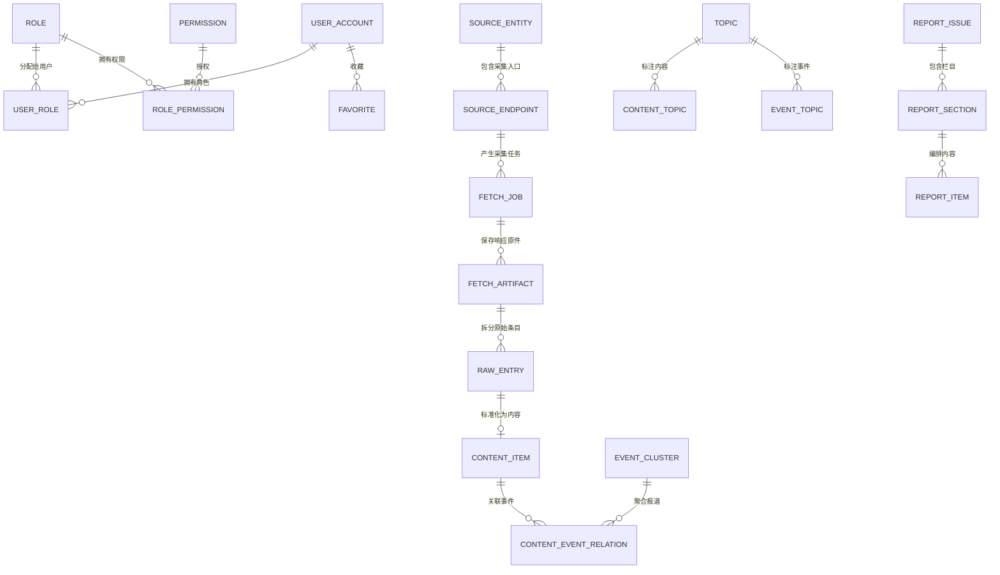

# AI Hotspot 数据库表全景与字段中文说明

> 基准日期：2026-07-18
> 当前阶段：M6 真实实现（Flyway V001～V010）
> 数据库：PostgreSQL 16 + pgvector 0.8.5
> 本文只把已经由迁移创建的对象称为“现有表”；M7～M10 对象单列为“规划表”，避免把设计稿误当成已实现数据库。

## 1. 如何阅读字段

- `UUID`：全局唯一编号；业务关联使用编号，不依赖容易变化的名称。
- `TIMESTAMPTZ`：带时区时间，数据库统一存 UTC，界面按 `Asia/Shanghai` 展示。
- `JSONB`：可查询的结构化扩展数据；只用于可变配置、快照和模型结果。
- `TSVECTOR`：PostgreSQL 全文检索索引文本，不直接展示给用户。
- `version`：乐观锁版本号；编辑时防止后提交的人覆盖先提交的人。
- `created_at / updated_at`：创建时间 / 最后更新时间。下文重复字段仍会列出，但含义相同。

## 2. 当前数据库全景

当前共有 **30 张业务表**：`iam` 7 张、`source` 5 张、`content` 13 张、`governance` 2 张、`messaging` 3 张。`knowledge`、`research`、`automation` Schema 已预留但尚无业务表，将在 M7～M9 逐阶段创建。

## 3. `iam`：用户、登录、角色与权限（7 张）

### 3.1 `iam.user_account`（用户账号）

| 字段 | 中文含义 |
|---|---|
| `id` | 用户唯一编号，主键 |
| `email` | 登录邮箱，忽略大小写且全局唯一 |
| `display_name` | 用户显示名称 |
| `password_hash` | 密码哈希；邮箱验证码用户可以为空，绝不保存明文密码 |
| `status` | 账号状态：邀请中、正常、停用或删除 |
| `locale` | 用户语言偏好，当前默认 `zh-CN` |
| `timezone` | 用户时区，默认 `Asia/Shanghai` |
| `version` | 乐观锁版本号 |
| `created_by` | 创建此账号的用户；公开注册时可为空 |
| `created_at` / `updated_at` | 创建时间 / 更新时间 |
| `last_login_at` | 最近一次成功登录时间 |

### 3.2 `iam.email_verification_challenge`（邮箱验证码挑战）

| 字段 | 中文含义 |
|---|---|
| `id` | 验证码请求唯一编号 |
| `email` | 接收验证码的邮箱 |
| `purpose` | 用途：`REGISTER` 注册或 `LOGIN` 登录 |
| `code_hash` | 验证码加盐摘要，不保存六位明文 |
| `expires_at` | 失效时间 |
| `consumed_at` | 成功使用时间；非空表示不能再次使用 |
| `failed_attempts` / `max_attempts` | 已失败次数 / 最大允许次数 |
| `requested_ip_hash` | 请求 IP 的不可逆摘要，用于反滥用 |
| `created_at` | 请求时间 |

### 3.3 `iam.invitation_code`（兼容保留的邀请码）

| 字段 | 中文含义 |
|---|---|
| `id` | 邀请码记录编号 |
| `code_hash` | 邀请码摘要，不保存明文 |
| `created_by` | 创建邀请码的管理员 |
| `default_role` | 使用后默认赋予的角色 |
| `max_uses` / `used_count` | 最大次数 / 已使用次数 |
| `expires_at` | 到期时间 |
| `status` | 可用、用尽、过期或撤销 |
| `version` | 并发更新版本号 |
| `created_at` | 创建时间 |

公开注册已经开放，此表只服务管理员定向邀请、测试或未来特殊角色发放，不再限制普通用户注册。

### 3.4～3.7 权限四表

| 表 | 字段及中文含义 |
|---|---|
| `iam.role` | `id` 角色编号；`code` 程序角色码；`display_name` 中文名称；`builtin` 是否内置；`created_at` 创建时间 |
| `iam.permission` | `id` 权限编号；`code` 权限码，如 `report:manage`；`description` 中文说明；`created_at` 创建时间 |
| `iam.user_role` | `user_id` 用户；`role_id` 角色；`assigned_by` 分配人；`assigned_at` 分配时间；用户与角色组成联合主键 |
| `iam.role_permission` | `role_id` 角色；`permission_id` 权限；两字段组成联合主键 |

普通注册固定获得 `USER`；管理端需要 `OPERATOR` 或 `ADMIN` 及具体权限，不能靠前端隐藏按钮代替后端授权。

## 4. `source`：信源、采集与原始数据（5 张）

### 4.1 `source.source_entity`（信源主体）

| 字段 | 中文含义 |
|---|---|
| `id` | 信源主体编号 |
| `name` / `slug` | 展示名称 / 稳定网址标识 |
| `entity_type` | 主体类型，如公司、研究机构、媒体或社区 |
| `country_code` | 国家或地区代码 |
| `official_level` | 官方等级：官方、一手、权威媒体、社区等 |
| `authority_score` | 权威分，用于质量评分 |
| `website_url` / `logo_url` | 官方主页 / Logo 地址 |
| `status` | 草稿、启用、暂停或归档 |
| `version` | 乐观锁版本 |
| `created_by` | 创建者 |
| `created_at` / `updated_at` | 创建 / 更新时间 |

### 4.2 `source.source_endpoint`（可采集入口）

| 字段 | 中文含义 |
|---|---|
| `id` / `source_entity_id` | 入口编号 / 所属信源主体 |
| `name` | 入口名称，如“OpenAI News RSS” |
| `url` / `normalized_url` | 原始地址 / 规范化去重地址 |
| `endpoint_type` | 入口类型：RSS、Atom、Sitemap、GitHub、arXiv 等 |
| `connector_type` | 实际使用的采集适配器 |
| `language` | 主要内容语言 |
| `polling_interval_seconds` | 轮询间隔秒数 |
| `display_policy` | 前台可展示范围策略 |
| `index_policy` | 能否进入全文/向量索引的策略；与展示策略分离 |
| `authority_override` | 对主体权威分的入口级覆盖值 |
| `config` | Connector 的结构化配置 |
| `credential_ref` | 凭据引用，不保存密钥明文 |
| `status` / `health_status` | 业务状态 / 健康状态 |
| `last_success_at` / `last_failure_at` | 最近成功 / 失败时间 |
| `failure_count` | 连续失败次数 |
| `last_probe_status` / `last_probe_latency_ms` | 最近探测 HTTP 状态 / 延迟毫秒 |
| `version` / `created_by` | 并发版本 / 创建者 |
| `created_at` / `updated_at` | 创建 / 更新时间 |
| `next_fetch_at` | 下次计划采集时间 |
| `last_etag` / `last_modified` / `last_content_hash` | 增量抓取缓存标识 |
| `last_fetch_item_count` / `last_fetch_job_id` | 最近抓到的条数 / 最近任务编号 |
| `catalog_kind` / `catalog_key` | 正式、测试或保留目录类型 / 目录稳定键 |

X 目前只保留 `RESERVED` 扩展契约，不启用、不调度、不采集；这与当前产品范围一致。

### 4.3 `source.fetch_job`（一次采集任务）

| 字段 | 中文含义 |
|---|---|
| `id` / `endpoint_id` | 任务编号 / 目标入口 |
| `trigger_type` | 触发方式：定时、手动、探测、重试等 |
| `scheduled_window` | 所属调度时间窗 |
| `idempotency_key` | 幂等键，避免同一时间窗重复任务 |
| `status` | 排队、运行、成功、等待重试、失败或死信 |
| `attempt_count` / `max_attempts` | 已尝试 / 最大尝试次数 |
| `http_status` | 最终 HTTP 状态码 |
| `artifact_count` / `discovered_count` / `new_entry_count` | 原件数 / 发现条目数 / 新条目数 |
| `error_code` / `last_error` | 结构化错误码 / 最后错误详情 |
| `correlation_id` / `trace_id` | 跨服务关联编号 / 链路追踪编号 |
| `replay_of_job_id` | 若为重放，指向原任务 |
| `requested_by` | 手动触发者 |
| `started_at` / `finished_at` | 开始 / 完成时间 |
| `created_at` / `updated_at` | 创建 / 更新时间 |

### 4.4 `source.fetch_artifact`（HTTP 响应原件）

| 字段 | 中文含义 |
|---|---|
| `id` / `fetch_job_id` / `endpoint_id` | 原件编号 / 任务 / 入口 |
| `attempt_no` | 属于任务的第几次尝试 |
| `request_url` / `final_url` | 请求地址 / 重定向后的最终地址 |
| `http_status` | HTTP 状态码 |
| `content_type` / `content_length` / `content_hash` | MIME 类型 / 字节数 / 内容摘要 |
| `etag` / `last_modified` | 上游缓存标识 |
| `object_bucket` / `object_key` | MinIO 桶名 / 对象路径；正文不塞入数据库 |
| `fetched_at` | 实际获取时间 |
| `metadata` | 响应头等扩展元数据 |
| `created_at` | 入库时间 |

### 4.5 `source.raw_entry`（从原件拆出的原始条目）

| 字段 | 中文含义 |
|---|---|
| `id` / `fetch_artifact_id` / `endpoint_id` | 条目编号 / 原件 / 入口 |
| `external_id` | 上游条目编号 |
| `original_url` / `canonical_url` | 原始链接 / 规范链接 |
| `raw_title` / `raw_summary` | 未加工标题 / 摘要 |
| `source_published_at` | 上游发布时间 |
| `author_name` | 原作者 |
| `payload` | 原始结构化字段快照 |
| `entry_hash` | 条目指纹，用于幂等和去重 |
| `normalization_status` | 未处理、已标准化或失败 |
| `first_seen_at` / `last_seen_at` | 首次 / 最近发现时间 |
| `created_at` / `updated_at` | 创建 / 更新时间 |

## 5. `content`：内容、事件、主题、报告与收藏（13 张）

### 5.1 `content.content_item`（公开产品的核心内容）

| 字段 | 中文含义 |
|---|---|
| `id` / `raw_entry_id` | 内容编号 / 对应原始条目 |
| `source_entity_id` / `endpoint_id` | 信源主体 / 采集入口 |
| `original_url` / `canonical_url` | 原始链接 / 规范链接 |
| `original_title` / `title_zh` | 原文标题 / 中文标题 |
| `summary_zh` / `recommendation_reason` | 中文摘要 / 精选理由 |
| `content_type` / `source_type` | 内容形态 / 来源类型 |
| `source_official_level` | 官方、一手、媒体或社区等级 |
| `source_published_at` | 原文发布时间 |
| `publication_status` | 草稿、候选、待审、已发布、取消发布或下架 |
| `visibility` | 公开、登录可见、私有或隐藏 |
| `admission_status` | 是否通过公开准入规则 |
| `fact_status` | 已确认、未证实或已证伪 |
| `display_policy` / `index_policy` | 展示策略 / 索引策略 |
| `relevance_score` / `quality_score` / `final_score` | AI 相关分 / 质量分 / 最终分 |
| `featured` | 是否精选 |
| `is_duplicate` / `duplicate_of_id` / `duplicate_similarity` | 是否重复 / 主内容 / 相似度 |
| `provider_name` / `provider_model` | 处理它的模型 Provider / 模型 |
| `processing_version` | 内容处理流水线版本 |
| `policy_snapshot` | 当时采用的内容策略快照 |
| `processed_at` / `published_at` | 处理完成 / 系统发布时间 |
| `category_code` / `language_code` | 分类码 / 语言码 |
| `confidence_score` | AI 结构化结果置信度 |
| `quality_dimensions` | 管理端可见的各质量维度 |
| `generation_metadata` | 翻译、摘要等生成过程元数据 |
| `version` | 乐观锁版本 |
| `search_tsv` | M6 新增的全文检索向量，标题和摘要变化时自动更新 |
| `created_at` / `updated_at` | 创建 / 更新时间 |

前台公开查询必须同时满足：`PUBLISHED + PUBLIC + PASSED + 非重复 + 非 DEBUNKED`。

### 5.2 `content.model_run`（内容模型执行记录）

| 字段 | 中文含义 |
|---|---|
| `id` / `content_item_id` | 执行编号 / 内容 |
| `provider_name` / `provider_model` | Provider / 模型名 |
| `prompt_version` | Prompt 版本 |
| `status` | 成功或失败状态 |
| `input_fingerprint` | 输入指纹，防止重复生成 |
| `output_data` | 结构化模型输出 |
| `error_code` / `latency_ms` | 错误码 / 耗时毫秒 |
| `created_at` | 执行时间 |

### 5.3 `content.event_cluster` 与 `content.content_event_relation`

| 表 | 字段及中文含义 |
|---|---|
| `event_cluster` | `id` 事件编号；`cluster_key` 聚类稳定键；`title`/`summary` 事件标题/摘要；`category_code` 分类；`status` 状态；`fact_status` 事实状态；`primary_content_id` 主报道；`first_seen_at`/`last_seen_at` 首次/最近时间；`version` 版本；创建/更新时间 |
| `content_event_relation` | `content_item_id` 内容；`event_cluster_id` 事件；`relation_type` 主报道/官方/研究/分析等关系；`confidence` 关联置信度；`is_primary` 是否主条目；`created_by` 操作者；`created_at` 创建时间 |

内容与事件为多对多，因此同一篇综合报道可以关联多个事件，也允许一个事件汇聚多个独立信源。

### 5.4 主题、实体与标签

| 表 | 字段及中文含义 |
|---|---|
| `content.topic` | `id` 主题编号；`slug` URL 标识；`group_code` 公司模型/技术方向/内容形态分组；`name` 名称；`description` 说明；`query_text` 自动聚合检索词；`status` 状态；`sort_order` 排序；创建/更新时间 |
| `content.content_topic` | `content_item_id` 内容；`topic_id` 主题；`assignment_source` AI/规则/人工；`confidence` 置信度；`created_at` 创建时间 |
| `content.event_topic` | `event_cluster_id` 事件；`topic_id` 主题；`assignment_source` 标注来源；`confidence` 置信度；`created_at` 创建时间 |
| `content.content_entity` | `id` 标注编号；`content_item_id` 内容；`entity_type` 公司/人物/模型等类型；`canonical_name` 规范名；`display_name` 展示名；`confidence` 置信度；`created_at` 创建时间 |
| `content.content_tag` | `content_item_id` 内容；`tag` 标签；`source` AI/规则/人工；`confidence` 置信度；`created_at` 创建时间 |

### 5.5 M6 报告编辑发布三表

| 表 | 字段及中文含义 |
|---|---|
| `content.report_issue` | `id` 报告编号；`period` 日/周/月；`start_date`/`end_date` 覆盖日期；`volume` 卷期标识；`headline` 主标题；`lead` 导语；`status` 草稿/已发布；`story_count` 内容数；`event_count` 独立事件数；`source_count` 信源数；`official_source_count` 官方信源数；`featured_count` 精选数；`estimated_minutes` 预计阅读分钟；`generation_metadata` 生成器和版本；`version` 乐观锁；`generated_at` 生成时间；`published_at`/`published_by` 发布时间/发布人；创建/更新时间 |
| `content.report_section` | `id` 栏目编号；`report_issue_id` 所属报告；`section_code` 栏目码；`title` 栏目名；`summary` 栏目导语；`sort_order` 顺序；`version` 版本；创建/更新时间 |
| `content.report_item` | `id` 编排项编号；`report_section_id` 栏目；`content_item_id` 内容；`position` 栏目内顺序；`editor_note` 编辑备注；`created_at` 创建时间 |

报告生成会写入草稿；管理员修改标题和导语后按 `version` 发布。公开日报、周报、月报优先读取已发布版本，没有已发布版本时才显示实时聚合预览。

### 5.6 `content.favorite`（服务端收藏）

| 字段 | 中文含义 |
|---|---|
| `user_id` | 收藏用户 |
| `target_type` | 收藏对象类型，当前支持 `CONTENT`，结构预留 `EVENT` |
| `target_id` | 内容或事件编号 |
| `created_at` | 收藏时间 |

三字段中的用户、类型、对象构成唯一约束，实现跨浏览器同步并避免重复收藏。

## 6. `governance`：审计与内容工单（2 张）

| 表 | 字段及中文含义 |
|---|---|
| `governance.audit_log` | `id` 审计编号；`actor_id` 操作者；`actor_type` 用户/系统；`action` 动作；`target_type`/`target_id` 对象类型/编号；`before_data`/`after_data` 修改前/后快照；`client_ip`/`user_agent` 客户端信息；`correlation_id`/`trace_id` 关联/追踪编号；`created_at` 时间 |
| `governance.content_ticket` | `id` 工单编号；`content_item_id`/`event_cluster_id` 内容/事件；`ticket_type` 纠错/下架/版权等类型；`status` 状态；`priority` 优先级；`reason` 原因；`contact_email` 联系邮箱；`resolution` 处理结论；`submitted_by`/`assigned_to`/`resolved_by` 提交/受理/解决人；`created_at`/`resolved_at`/`updated_at` 创建/解决/更新时间 |

## 7. `messaging`：可靠异步消息（3 张）

| 表 | 字段及中文含义 |
|---|---|
| `messaging.outbox_event` | `id` 记录编号；`event_id` 业务事件唯一编号；`event_type`/`event_version` 事件类型/版本；`aggregate_type`/`aggregate_id` 聚合类型/编号；`payload` 消息体；`status` 状态；`retry_count` 重试次数；`next_retry_at` 下次重试；`created_at`/`published_at` 创建/发布；`last_error` 最后错误 |
| `messaging.consumer_inbox` | `event_id` 事件；`idempotency_key` 幂等键；`consumer_name` 消费者；`status` 状态；`processed_at` 完成时间；`result` 结果；`last_error` 错误；`created_at` 创建时间 |
| `messaging.dead_letter_record` | `id` 死信编号；`original_event_id` 原事件；`queue_name` 队列；`event_type` 类型；`payload` 原消息；`failure_count` 失败次数；`first_failed_at`/`last_failed_at` 首次/最近失败；`last_error` 最终错误；`replay_status` 重放状态；`replayed_by`/`replay_event_id` 重放人/新事件；`idempotency_key` 幂等键；`aggregate_type`/`aggregate_id` 聚合；`correlation_id`/`trace_id` 追踪；`created_at` 创建时间 |

## 8. 已安装但尚未建业务表的 Schema

| Schema | 当前状态 | 原因 |
|---|---|---|
| `knowledge` | 空，M7 创建 | 需先确定 Chunk 大小、权限过滤 SQL、bge-m3 维度与索引基准 |
| `research` | 空，M7 创建 | 随 RAG 引用和研究会话一起实现 |
| `automation` | 空，M8/M9 创建 | 订阅邮件和 Agent 尚未进入对应里程碑 |

pgvector 扩展已经安装，但当前没有伪造空向量列；向量表会在 M7 随真实 Embedding、回填任务和召回评测一起上线。

## 9. M7～M10 规划表与未来操作

### M7：知识检索、RAG 与研究

- `knowledge.knowledge_dataset`：公共/私有知识集、所有者、版权确认和状态。
- `knowledge.dataset_acl`：用户或角色对数据集的读取/管理权限；检索前先过滤。
- `knowledge.knowledge_chunk`：内容切片、标题路径、文本、Token 数、Embedding、模型版本和 FTS。
- `knowledge.index_job`：切片、嵌入、重建、删除的可恢复任务。
- `research.conversation`、`research.message`：研究会话与问答消息。
- `research.citation`：答案句段到内容/Chunk 的可验证引用。
- `research.research_job`：长时间研究任务、计划、状态和报告文件。

数据库操作：V011 建表；对已允许索引的公开内容增量回填；先做权限过滤再做 FTS/向量召回；按评测决定 HNSW 参数；删除或下架内容时同步删除 Chunk 与向量。

### M8：订阅与邮件

- `automation.subscription`：用户订阅条件、日/周频率、时区、开关和下次运行时间。
- `automation.subscription_run`：一次时间窗的简报生成，唯一键防止重复。
- `automation.email_delivery`：收件人、模板快照、Provider 消息号、成功/失败/重试。
- `automation.unsubscribe_token`：一键退订 Token 摘要、用途、到期和使用时间。

数据库操作：V012 建表和调度索引；Mailpit 做本地验收；生产 SMTP 只通过 `MailProvider`；投递前再次检查退订状态。

### M9：Agent、模型路由与审批

- `automation.agent_run`、`agent_step`、`tool_call`：Agent 目标、权限快照、步骤、工具参数与结果。
- `automation.approval_request`：高影响动作的一次性人工审批。
- `governance.model_provider_config`、`model_route`、`prompt_version`：加密 Provider 配置、任务路由和 Prompt 版本。

数据库操作：V013 建表；所有运行继承用户权限；参数变化使旧审批失效；模型密钥只保存加密引用。

### M10：Beta 硬化

- 为高频公开查询、邮件投递、审计和向量查询补充基于真实 `EXPLAIN ANALYZE` 的索引。
- 建立 PostgreSQL 逻辑备份、MinIO 对象备份、恢复演练和校验记录。
- 按实际增长决定是否对任务、审计、模型运行按月分区；MVP 不提前复杂化。
- 增加数据保留和匿名化清理任务；下架先阻断展示/检索，再异步物理清理。
- 迁移只前进，不修改已在环境执行的 V001～V010；修复一律新增补偿迁移。

## 10. 当前关键约束与索引

- 用户邮箱唯一；角色码和权限码唯一。
- 启用信源使用规范化 URL 和目录键去重。
- 采集任务 `idempotency_key` 唯一；原始条目按入口和外部编号/指纹幂等。
- 公开内容使用部分索引；M6 `search_tsv` 使用 GIN 全文索引。
- 一个事件只允许一个 `is_primary=true` 的主条目。
- 同周期同起始日期只允许一个报告版本聚合根；编辑通过 `version` 防并发覆盖。
- 同一用户不能重复收藏同一对象。
- Outbox 事件唯一，Inbox 对消费者幂等，死信可审计重放。

## 11. 本地查看数据库

- 主机：`127.0.0.1`
- 端口：`15432`（容器内部仍为 5432）
- 数据库：`ai_hotspot`
- 用户：`ai_hotspot`
- 密码：读取项目根目录 `.env` 的 `POSTGRES_PASSWORD`
- Navicat 中展开 `ai_hotspot` 数据库后可看到上述八个 Schema。

`.env` 只供本地运行且不得提交；生产环境必须更换数据库密码、管理员密码和验证码 pepper。
