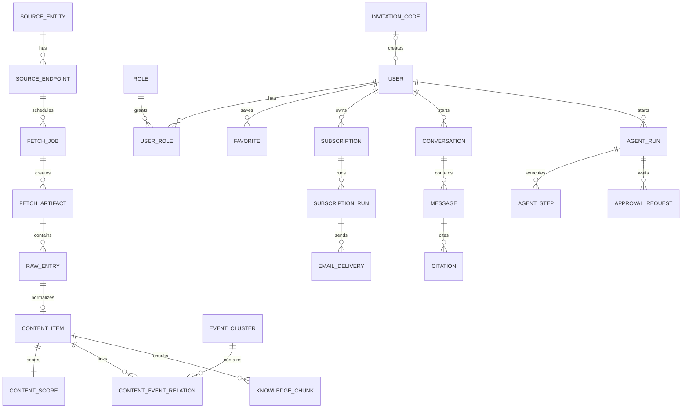

# AI Hotspot 数据模型总览

> 文档状态：待确认  
> 本文定义 MVP 领域对象和关键字段。最终 SQL、字段长度和索引参数在数据库详细设计中确定。

## 1. 建模原则

1. 原始采集、原始条目、标准化内容、事件和知识切片分层；
2. 内容与事件是多对多；
3. 展示策略和索引策略独立；
4. 所有发布、下架、模型和异步任务可追溯；
5. 大文件存 MinIO，PostgreSQL 存元数据；
6. 权限字段参与检索前过滤；
7. 业务表与 Outbox 在同一事务中写入；
8. Consumer Inbox 阻止重复副作用；
9. 时间统一存 UTC；
10. 枚举在代码和数据库约束中保持一致。

## 2. 核心关系



## 3. 用户、邀请与权限

### `user_account`

```text
id UUID PK
email CITEXT UNIQUE
display_name VARCHAR
password_hash VARCHAR NULL
status INVITED|ACTIVE|SUSPENDED|DELETED
locale VARCHAR DEFAULT zh-CN
timezone VARCHAR DEFAULT Asia/Shanghai
created_by UUID NULL
created_at TIMESTAMPTZ
updated_at TIMESTAMPTZ
last_login_at TIMESTAMPTZ NULL
```

### `invitation_code`

```text
id UUID PK
code_hash VARCHAR UNIQUE
created_by UUID FK
default_role VARCHAR
max_uses INT
used_count INT
expires_at TIMESTAMPTZ
status ACTIVE|EXHAUSTED|EXPIRED|REVOKED
created_at TIMESTAMPTZ
```

不得明文长期保存邀请码。

### 权限表

使用 `role`、`permission`、`user_role` 和 `role_permission`。MVP 至少包含 USER、EDITOR、OPERATOR、ADMIN。游客不是数据库角色，而是未认证访问公开资源的状态。

## 4. 信源与采集

### `source_entity`

保存名称、slug、主体类型、国家、官方等级、权威分、官网、Logo、状态和审计时间。

### `source_endpoint`

```text
id UUID PK
source_entity_id UUID FK
name VARCHAR
url TEXT
normalized_url TEXT
endpoint_type RSS|ATOM|WEBSITE|SITEMAP|GITHUB|HUGGING_FACE|ARXIV|OPENREVIEW|HACKER_NEWS|PUBLIC_MEDIA|PUBLIC_COMMUNITY
connector_type VARCHAR
language VARCHAR NULL
polling_interval_seconds INT
display_policy VARCHAR
index_policy VARCHAR
authority_override NUMERIC NULL
config JSONB
credential_ref VARCHAR NULL
status DRAFT|ACTIVE|PAUSED|ARCHIVED
health_status UNKNOWN|HEALTHY|WARNING|FAILED
last_success_at TIMESTAMPTZ NULL
last_failure_at TIMESTAMPTZ NULL
failure_count INT DEFAULT 0
created_by UUID
created_at TIMESTAMPTZ
updated_at TIMESTAMPTZ
```

约束：启用入口 `normalized_url` 唯一；endpoint_type 不包含 X 或微信公众号；只有 ADMIN/OPERATOR 可通过业务接口写入；`config` 由 Connector JSON Schema 校验。

### `fetch_job`

```text
id UUID PK
endpoint_id UUID FK
job_type PROBE|SCHEDULED|MANUAL|RETRY
scheduled_at TIMESTAMPTZ
started_at TIMESTAMPTZ NULL
finished_at TIMESTAMPTZ NULL
status QUEUED|RUNNING|SUCCEEDED|FAILED|DEAD_LETTERED|CANCELLED
attempt INT
idempotency_key VARCHAR UNIQUE
cursor_before JSONB
cursor_after JSONB
result_count INT DEFAULT 0
http_status INT NULL
latency_ms BIGINT NULL
error_code VARCHAR NULL
error_message TEXT NULL
correlation_id UUID
trace_id UUID
created_at TIMESTAMPTZ
```

### `fetch_artifact`

表示一次 HTTP/RSS/API 响应，不等于一篇文章。保存 job、endpoint、请求和最终 URL、MinIO Object Key、Hash、MIME、大小、HTTP 状态、ETag、Last-Modified、抓取时间和元数据。

### `raw_entry`

表示从采集原件中拆出的单条候选，保存 external_id、original_url、canonical_url、原始标题、原始时间、JSONB payload、entry_hash 和标准化状态。

唯一约束按 Connector 使用：`endpoint_id + external_id` 或 `canonical_url + entry_hash`。

## 5. 内容与质量

### `content_item`

```text
id UUID PK
raw_entry_id UUID FK NULL
source_entity_id UUID FK
endpoint_id UUID FK
canonical_url TEXT
title_original TEXT
title_zh TEXT
summary_zh TEXT
recommendation_reason TEXT NULL
body_object_key TEXT NULL
body_text_hash VARCHAR NULL
language VARCHAR
published_at TIMESTAMPTZ
content_type VARCHAR
fact_status CONFIRMED|UNCONFIRMED|DEBUNKED
official_flag BOOLEAN
processing_status PENDING|PROCESSING|PROCESSED|FAILED
publication_status DRAFT|CANDIDATE|REVIEW_REQUIRED|PUBLISHED|UNPUBLISHED|REMOVED
visibility PUBLIC|AUTHENTICATED|PRIVATE|HIDDEN
display_policy FULLTEXT_ALLOWED|SUMMARY_ONLY|LINK_ONLY|HIDDEN
index_policy PUBLIC_RAG|PRIVATE_RAG|METADATA_ONLY|NO_INDEX
relevance_score NUMERIC
quality_score NUMERIC
final_score NUMERIC
featured BOOLEAN DEFAULT FALSE
duplicate_of_id UUID NULL
published_by UUID NULL
published_at_system TIMESTAMPTZ NULL
removed_at TIMESTAMPTZ NULL
created_at TIMESTAMPTZ
updated_at TIMESTAMPTZ
```

公开查询必须同时限制 `PUBLISHED + PUBLIC`，执行准入阈值与策略条件，并排除非主重复内容。

### `content_score`

保存 authority、first_party、ai_relevance、quality、novelty、impact、information_density、independent_source、timeliness 及各类 penalty，并保存 algorithm_version、explanation 和 computed_at。普通用户只读最终分；分项仅管理端可见。

### `duplicate_relation`

保存左右内容、EXACT/NEAR_DUPLICATE/SYNDICATED/UPDATED_VERSION 关系、相似度、理由、算法版本和审核状态。

## 6. 事件、主题与实体

### `event_cluster`

保存标题、摘要、primary_content_id、event_type、fact_status、起止时间、heat_score、independent_source_count、聚类版本、审核状态和合并目标。

### `content_event_relation`

```text
event_id UUID FK
content_id UUID FK
relation_type PRIMARY|OFFICIAL|RESEARCH|REPORT|ANALYSIS|OPINION|UNCONFIRMED_REPORT|DUPLICATE
similarity_score NUMERIC NULL
confidence NUMERIC
join_reason TEXT
added_by_type SYSTEM|AI|USER
added_by_id UUID NULL
review_status AUTO_ACCEPTED|PENDING|CONFIRMED|REJECTED
created_at TIMESTAMPTZ
updated_at TIMESTAMPTZ
PRIMARY KEY(event_id, content_id)
```

一篇内容可以关联多个事件；同一事件最多一个当前 PRIMARY 关系。

### 分类对象

`topic`、`entity`、`tag` 分别使用独立主表与 `content_topic`、`event_topic`、`content_entity`、`event_entity`、`content_tag` 关联表。关联保存来源（AI/规则/人工）、置信度和确认状态。

## 7. 知识、搜索与研究

### `knowledge_dataset`

区分 PUBLIC 与 PRIVATE 数据集，保存 owner、access_policy、license_confirmation 和状态。

### `knowledge_chunk`

```text
id UUID PK
dataset_id UUID FK
content_id UUID FK NULL
event_id UUID NULL
chunk_index INT
heading_path TEXT NULL
text TEXT
token_count INT
source_level VARCHAR
published_at TIMESTAMPTZ NULL
entities JSONB
topics JSONB
language VARCHAR
index_policy PUBLIC_RAG|PRIVATE_RAG
embedding VECTOR
embedding_model VARCHAR
embedding_version VARCHAR
search_tsv TSVECTOR
created_at TIMESTAMPTZ
```

检索 SQL 必须先限制 dataset/access_policy，再执行 FTS 和向量召回。

### 研究对象

`conversation`、`message`、`citation` 保存问题、过滤条件、检索结果、答案、引用、模型、Prompt、延迟、费用和权限范围快照。`research_job` 保存长时间研究目标、计划、状态、报告 Object Key、错误和 traceId。

## 8. 收藏、订阅和邮件

### `favorite`

用户与 Content/Event 的多态收藏，唯一约束为 `user_id + target_type + target_id`。

### `subscription`

```text
id UUID PK
user_id UUID FK
name VARCHAR
frequency DAILY|WEEKLY
schedule_cron VARCHAR
timezone VARCHAR DEFAULT Asia/Shanghai
window_duration VARCHAR
query_text TEXT NULL
structured_filter JSONB
max_items INT
enabled BOOLEAN
unsubscribed_at TIMESTAMPTZ NULL
last_run_at TIMESTAMPTZ NULL
next_run_at TIMESTAMPTZ NULL
created_at TIMESTAMPTZ
updated_at TIMESTAMPTZ
```

`subscription_run` 按订阅与时间窗口唯一，防止重复生成。

### `email_delivery`

保存 subscription_run、recipient、provider、唯一 message_key、内容快照、状态、attempt、provider_message_id、错误和发送时间。退订 Token 使用安全随机或签名 Token，存储 Hash 或验证信息。

## 9. 模型与 Prompt

- `model_provider_config`：Provider、Base URL、加密 credential_ref、启用和健康状态；
- `model_route`：任务类型到主/回退模型、超时、重试和参数映射；
- `prompt_version`：任务、版本、模板、JSON Schema、状态和变更说明；
- `model_run`：模型、Prompt、输入 Hash、结构化输入输出、Token、费用、延迟和错误。

## 10. Agent、审批与审计

- `agent_run`：目标、调用者、权限快照、状态、费用和 traceId；
- `agent_step`：计划、工具、参数、结果和错误；
- `approval_request`：工具、参数 Hash、影响摘要、审批状态、过期时间和一次性 Token；
- `audit_log`：actor、动作、对象、前后差异、客户端、correlationId 和 traceId。

Agent 状态至少包含 QUEUED、RUNNING、WAITING_APPROVAL、SUCCEEDED、FAILED、CANCELLED。参数变化后原审批失效。

## 11. 反馈、纠错和下架

`feedback_ticket` 保存提交人、目标类型/ID、CORRECTION/TAKEDOWN/COPYRIGHT/OTHER 类型、说明、状态、处理人和结论。下架和恢复通过 `moderation_action` 与审计记录保存，不能只修改一个布尔值。

## 12. 可靠消息表

### `outbox_event`

```text
id UUID PK
event_id UUID UNIQUE
event_type VARCHAR
event_version INT
aggregate_type VARCHAR
aggregate_id UUID
payload JSONB
status PENDING|PUBLISHING|PUBLISHED|FAILED
retry_count INT
next_retry_at TIMESTAMPTZ NULL
created_at TIMESTAMPTZ
published_at TIMESTAMPTZ NULL
last_error TEXT NULL
```

### `consumer_inbox`

```text
event_id UUID
idempotency_key VARCHAR
consumer_name VARCHAR
status PROCESSING|SUCCEEDED|FAILED
processed_at TIMESTAMPTZ NULL
result JSONB NULL
last_error TEXT NULL
created_at TIMESTAMPTZ
PRIMARY KEY(event_id, consumer_name)
UNIQUE(idempotency_key, consumer_name)
```

### `dead_letter_record`

保存原消息、原队列、失败次数、最终错误、首次/最后失败时间、重放状态、重放操作者和新事件 ID，供管理端查看和人工重放。

## 13. 关键索引

- `content_item(publication_status, visibility, published_at DESC)`；
- `content_item(source_entity_id, published_at DESC)`；
- `content_item(fact_status, featured, final_score DESC)`；
- `raw_entry(endpoint_id, external_id)`；
- `content_event_relation(content_id)` 与 `(event_id, relation_type)`；
- `event_cluster(last_seen_at DESC, heat_score DESC)`；
- `knowledge_chunk USING GIN(search_tsv)`；
- KnowledgeChunk pgvector 索引，HNSW/IVFFlat 由数据量实验决定；
- `fetch_job(endpoint_id, scheduled_at DESC)`；
- `outbox_event(status, next_retry_at)`；
- `consumer_inbox(idempotency_key, consumer_name)`；
- `email_delivery(status, created_at)`；
- `audit_log(target_type, target_id, created_at DESC)`。

## 14. 数据删除与恢复原则

- 下架先改变业务可见性并清理检索；
- 物理删除通过独立清理任务；
- MinIO 对象删除与数据库状态使用异步可重试任务；
- PRIVATE_RAG 删除必须同时删除 Chunk、FTS 和向量；
- DEBUNKED 默认移除不等于立即物理删除；
- 审计保留最小必要记录；
- 具体保留期限在数据生命周期文档中确认。

