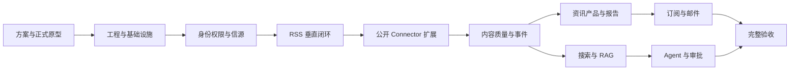

# AI Hotspot 项目阶段路线图

> 文档状态：M0、M1、M2 已完成本地技术验收；下一阶段为 M3。

## 1. 路线原则

1. MVP 功能域完整，但通过垂直闭环逐步交付；
2. 每个阶段必须有可运行、可测试和可追溯结果；
3. 不长期并行建设多个只有页面或接口空壳的模块；
4. RabbitMQ、Outbox、Inbox、权限和审计从基础阶段进入，不在末期补救；
5. 先使用少量真实公开信源验证，再扩大 Source Registry；
6. 无模型密钥时使用 Mock Provider，不阻塞工程和自动化测试；
7. X 与微信公众号不进入任何 MVP 里程碑。

## 2. 阶段依赖



## 3. M0：方案基线与正式原型

### 范围

- 初始化项目根目录 Git 仓库、main 分支和 `.gitignore`；
- 提交原始参考文件和当前方案基线，创建 `planning-v1` Tag；
- 产品、用户、范围和业务规则；
- 信息架构和页面规格；
- 领域模型和状态机；
- 技术架构、数据、接口和异步事件；
- 安全、版权、测试和运维；
- 正式 Next.js 原型方案；
- 现有 HTML 原型与 AI HOT 截图基线；
- 原型迭代约束和视觉验收清单；
- Git 版本管理方案；
- 需求追踪矩阵。

### 退出条件

- P0 决策全部确认；
- 原始参考、截图基线和方案已进入 Git，敏感和运行数据已忽略；
- 页面、业务对象、权限和接口不存在明显冲突；
- 新原型严格继承现有原型的导航、信息密度、时间线、卡片和视觉方向；
- 原型覆盖内容、研究、自动化和管理工作区；
- 关键页面提供修改前后对照和响应式检查；
- 产品负责人确认进入编码。

## 4. M1：工程骨架与本地基础设施

> 实施状态：已于 2026-07-17 完成本地验收，并以 `m1-foundation-v1` 冻结。

### 范围

- 按既定 Git 任务分支、提交和里程碑 Tag 规则执行；
- Monorepo；
- Next.js、Spring Boot、FastAPI/Python Worker；
- Docker Compose；
- PostgreSQL/pgvector、Redis、RabbitMQ、MinIO、Mailpit；
- Flyway；
- OpenAPI；
- 统一日志、correlationId、traceId；
- Provider 接口和 Mock Provider；
- 健康检查；
- PowerShell Compose 辅助脚本。

### 退出条件

- 原始参考文件、方案和原型基线持续可追溯；
- 密钥、数据卷、日志、抓取原件和模型缓存不会进入 Git；
- 所有工程修改通过任务分支和小步提交完成；
- Windows + Docker Desktop + WSL2 一条命令启动；
- 所有容器健康；
- Web 能调用 Core API；
- Core API 能创建 Outbox 并发布测试消息；
- Worker 能通过 Inbox 幂等消费；
- Mailpit 可看到测试邮件；
- 无真实 API Key 仍能完成测试。

## 5. M2：邀请制身份、权限和信源管理

> 实施状态：已于 2026-07-17 完成本地自动化、Compose、API 与浏览器验收；详细证据见《M2身份权限与信源管理验收记录》。

### 范围

- 管理员创建用户；
- 邀请码注册；
- 登录与会话；
- RBAC；
- 游客公开访问边界；
- SourceEntity/SourceEndpoint；
- Connector 配置 Schema；
- 信源列表、详情、新增和试抓取页面；
- 审计。

### 退出条件

- 公众自由注册关闭；
- 游客只能访问公开页面；
- USER 不能修改信源；
- ADMIN/OPERATOR 可以试抓取和启用入口；
- 所有信源写操作有审计。

## 6. M3：RSS/Atom 真实垂直闭环

### 范围

```text
SourceEndpoint
→ FetchJob
→ RabbitMQ
→ RSS Worker
→ FetchArtifact/MinIO
→ RawEntry
→ ContentItem
→ Mock/真实 AI 处理
→ 准入与发布
→ 公开页面
```

- ETag、Last-Modified 和增量游标；
- 幂等、重试和 DLQ；
- 原始数据追踪；
- 基础精选、全部公开动态和内容详情。

### 退出条件

- 至少 3 个真实 RSS/Atom 入口持续运行；
- 重复采集不重复建内容；
- RabbitMQ 暂停恢复后不丢任务；
- 失败可进入 DLQ 并人工重放；
- 公开内容满足 PUBLISHED + PUBLIC 准入。

## 7. M4：公开 Connector 扩展

### 范围

- Website/Sitemap；
- GitHub；
- Hugging Face；
- arXiv；
- OpenReview；
- Hacker News；
- 公开 AI 技术媒体和开发者社区；
- 采集监控、任务详情和结构变化告警。

### 退出条件

- 每类 Connector 有离线 Fixture 和真实成功样本；
- 失败分类明确；
- 入口级限速和响应大小限制有效；
- 不存在 X 或微信公众号 Collector；
- 采集任务可追踪到 MinIO 原件。

## 8. M5：内容质量、准入和事件

### 范围

- 中文标题、摘要、分类、标签和实体；
- relevance_score、quality_score 和 final_score；
- 推荐理由；
- CONFIRMED/UNCONFIRMED/DEBUNKED；
- 精确和近重复；
- EventCluster；
- ContentEventRelation 跨事件关联；
- 内容和事件审核；
- 纠错、下架、恢复和工单。

### 退出条件

- 评分阈值配置化；
- 普通用户只见最终分；
- UNCONFIRMED 标记和默认不精选有效；
- DEBUNKED 从默认结果移除；
- 内容可关联多个事件；
- 人工纠正有理由、审计和评测样本。

## 9. M6：完整资讯产品、日报和周报

### 范围

- 精选；
- 全部公开动态；
- 热点事件；
- 日报和周报；
- 主题与详情；
- 内容与事件详情；
- 公开搜索；
- 收藏；
- 报告生成、编辑、预览和发布；
- 响应式和主要状态。

### 退出条件

- 游客无需登录完成公开浏览和搜索；
- 登录用户可以收藏；
- 热点按独立事件而非文章数展示；
- 日报、周报可生成和发布；
- 下架内容不再公开。

## 10. M7：知识索引、搜索与 RAG

### 范围

- display_policy/index_policy；
- KnowledgeDataset/KnowledgeChunk；
- PostgreSQL FTS；
- bge-m3 Embedding；
- 权限前置过滤；
- 混合检索和事件折叠；
- bge-reranker-v2-m3；
- Query Understanding；
- SSE 回答；
- 引用和 Citation Validator；
- RAG 评测集。

### 退出条件

- PUBLIC_RAG 与 PRIVATE_RAG 严格隔离；
- 无权用户不能召回私有 Chunk；
- 重要结论有真实引用；
- 资料不足不使用训练记忆补齐；
- 官方来源和时间过滤遵从率达标；
- Mock 与真实 Provider 均可运行。

## 11. M8：订阅、每日/每周邮件

### 范围

- Subscription 和 SubscriptionRun；
- 自然语言解析与结构化预览；
- 每日 09:00、每周一 09:00、Asia/Shanghai；
- 报告到邮件；
- RabbitMQ Notification Worker；
- MailProvider、Mailpit 和 SMTP；
- 一键退订和偏好入口；
- 投递历史、重试和死信。

### 退出条件

- 同一订阅窗口不重复发送；
- Mailpit 完整显示 HTML 和退订链接；
- SMTP 可配置；
- 退订后不再发送；
- SMTP 暂时失败执行重试，最终失败可见和可重放。

## 12. M9：Agent、审批和长任务

### 范围

- Research Agent；
- Subscription Agent；
- Source Operations Agent；
- Crawler Operations Agent；
- LangGraph 状态和恢复；
- AgentRun/AgentStep；
- RabbitMQ Agent Worker；
- 工具权限；
- 高风险审批；
- 取消、重试、费用和审计。

### 退出条件

- Research Agent 生成带引用报告；
- Agent 继承用户数据权限；
- Source Agent 可试抓取但不能越权启用；
- 参数变化使原审批失效；
- 拒绝后不能继续写操作；
- 运行步骤、费用和错误可查看。

## 13. M10：完整验收与邀请制 Beta 准备

### 范围

- 连续运行；
- 数据质量和 RAG 评测；
- 权限和安全测试；
- Outbox/Inbox/RabbitMQ 故障演练；
- 备份和恢复；
- 性能和资源校准；
- 文档和需求追踪；
- 单机 Linux Compose 部署演练；
- Beta 前合规清单。

### 退出条件

- 产品验收标准全部有证据；
- 无 P0/P1 已知缺陷；
- 备份恢复演练通过；
- 死信和人工重放通过；
- 无越权私有检索；
- 本地和 Linux 环境启动文档可复现；
- 产品负责人批准进入邀请制 Beta。

## 14. 里程碑共同完成定义

每个里程碑必须包含：

- 代码与迁移；
- API/事件契约；
- 单元、集成和必要的 E2E 测试；
- 权限和审计；
- 启动与验证命令；
- 可观测性；
- 已知限制；
- 需求追踪更新；
- 评审和验收记录。
