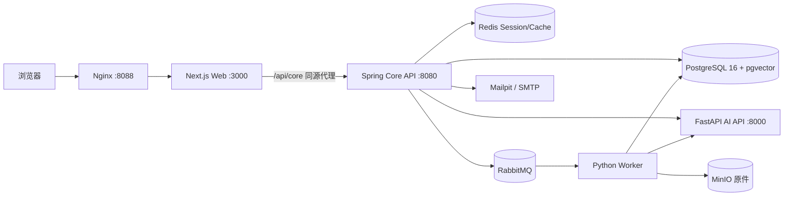
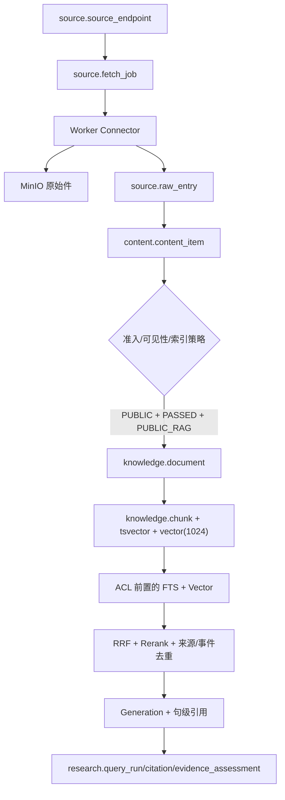

# 当前工程与代码框架全景

> 基于 2026-07-23 的 `codex/ui-fidelity-prototype` 分支盘点。这份文档解释“代码在哪里、谁调用谁、什么能改”，不重复产品需求。

## 1. 总体结论

当前是一个边界清晰的三应用 Monorepo，不需要重构为更多微服务：

- `apps/web`：Next.js 16 + React 19，负责公开产品、登录态工作台和管理界面；
- `services/core`：Java 17 + Spring Boot 4.1，负责业务规则、权限、事务、数据库、调度和治理；
- `services/ai`：Python 3.12 + FastAPI，负责 Connector 解析、内容分析、Embedding/Rerank/Generation 和异步 Worker；
- `packages/contracts`：事件包络和 OpenAPI 契约；
- `infra` + `compose.yaml`：10 个运行服务的唯一编排入口；
- `scripts`：启停、测试、备份恢复和 M7～M10 门禁包装；
- `AI Hotspot 项目方案`：现行设计、历史验收和本次交接材料。

## 2. 顶层目录职责

| 路径 | 当前职责 | 是否运行时必需 |
|---|---|---|
| `.github/workflows/ci.yml` | CI 中的前端、Core、AI 和 Compose 配置检查 | 交付必需 |
| `apps/web` | 29 个 App Router 页面/路由、13 个 UI 组件和数据访问层 | 是 |
| `services/core` | 66 个主代码 Java 文件、11 个测试文件、Flyway V001～V031 | 是 |
| `services/ai` | 17 个主代码 Python 文件、7 个测试文件 | 是 |
| `packages/contracts` | HTTP/事件契约，但 OpenAPI 覆盖尚不完整 | 应保留 |
| `infra/nginx` | 同源转发与健康入口 | 是 |
| `scripts` | 18 个 PowerShell 运维/验证脚本 | 本地交付必需 |
| `archive` | 早期 AI Pulse 方案，只作历史参考 | 否，但应保留 |
| `artifacts` | 忽略的本地截图、备份和构建产物 | 否，可定期清理 |
| `AI_HOTSPOT_PROTOTYPE.html` | 可视化原型基线 | 否，应保留 |
| `.env` | 本机密钥与凭据，已 Git 忽略 | 运行需要，禁止提交 |

## 3. Web 代码地图

### 页面组

- 公开资讯：`/`、`/all`、`/daily`、`/weekly`、`/monthly`、`/reports`、`/topics`、`/content/[id]`、`/events/[id]`；
- 用户能力：`/login`、`/register`、`/favorites`、`/subscriptions`、`/research`、`/agent`；
- 管理端：`/admin/sources`、`crawls`、`content`、`reports`、`models`、`operations`、`readiness`、`users`；
- 代理层：`app/api/core/[...path]/route.ts` 将浏览器请求同源转发到 Core，避免前端直接暴露内部地址。

### 核心组件与数据层

- `app-shell.tsx`、`sidebar.tsx`、`page-header.tsx`：全局壳、导航和页头；
- `public-feed.tsx`、`public-content-card.tsx`：真实公开流、按日折叠和游标加载；
- `report-view.tsx`、`favorites-view.tsx`、`favorite-button.tsx`：报告与登录态交互；
- `product-workspaces.tsx`：RAG、Agent 及多个管理工作台的集中实现，是后续拆分点；
- `lib/api.ts`：Core API 客户端；`public-content.ts`、`public-report.ts`、`public-discovery.ts` 是公开数据查询适配。

## 4. Core 代码地图

| 包 | 职责 |
|---|---|
| `auth` / `config` | 邮箱验证码、会话、角色权限和 Spring Security |
| `content` | 公开资讯、事件、主题、收藏、报告、审核和对账 |
| `source` / `crawl` | Endpoint 管理、质量统计、抓取调度、异常和轮询结果 |
| `knowledge` | 知识索引、研究问答、RAG 配置/评测/监控 |
| `agent` | Agent 运行和受控工具流程 |
| `subscription` / `notification` | 订阅调度、邮件渲染、Mailpit/SMTP 投递 |
| `messaging` | RabbitMQ/Outbox 连接与可靠消费 |
| `operations` / `audit` | 就绪检查、死信、运维动作和审计日志 |
| `api` | 统一错误、请求上下文和通用响应边界 |

Core 使用 Spring JDBC/MyBatis 风格的显式 SQL 处理关键查询，Flyway 是唯一 DDL 入口。JPA 依赖已在 POM 中，但不应因为依赖存在就全量改写数据访问层。

## 5. AI API / Worker 代码地图

| 模块 | 职责 |
|---|---|
| `main.py` / `schemas.py` | FastAPI 路由和请求/响应契约 |
| `connectors.py` / `feed.py` | RSS/Atom、网页、GitHub、Hugging Face、OpenReview、HN、Sitemap 解析，SSRF 和日期处理 |
| `pipeline.py` / `content_analysis.py` | 内容清洗、分析、质量与发布判定 |
| `providers/*` | Mock 与 OpenAI-compatible 的 Generation/Embedding/Rerank 适配 |
| `repository.py` | PostgreSQL 持久化、幂等、内容/索引/轮询结果落库；865 行，应按聚合拆分 |
| `worker.py` | RabbitMQ 队列消费、重试、结果回写 |
| `storage.py` / `settings.py` | MinIO 原件与环境配置 |

Mock Provider 是测试和无 Key 启动能力，不是可删的“假代码”。数据库发布/索引门禁保证 Mock/Test/Fixture 不进公开内容与 RAG。

## 6. 数据与 RAG 链路

PostgreSQL 当前有 8 个业务 Schema：`iam`、`source`、`content`、`knowledge`、`research`、`automation`、`messaging`、`governance`，共 56 张业务表；`public` 中另有 Flyway 历史表。迁移已到 V031，后续只能新增 V032+。

## 7. 请求和异步边界

- 浏览与管理请求：浏览器 → Next 同源代理 → Core → PostgreSQL/Redis；
- AI 同步能力：Core → AI API，由 Core 执行权限、审计和最终入库；
- 采集与索引：Core 写 Outbox/发 RabbitMQ → Worker → 原件/数据库 → 后续事件；
- 邮件：Core 订阅任务 → SMTP，本地用 Mailpit；
- 不使用 Kafka、Elasticsearch、Kubernetes 或 LangGraph，目前没有指标支持引入。
