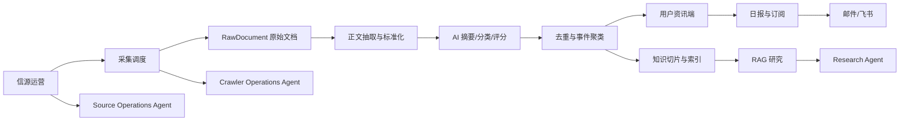
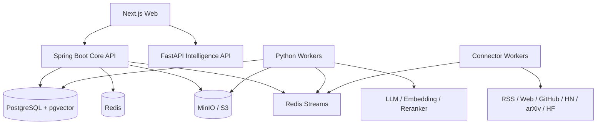
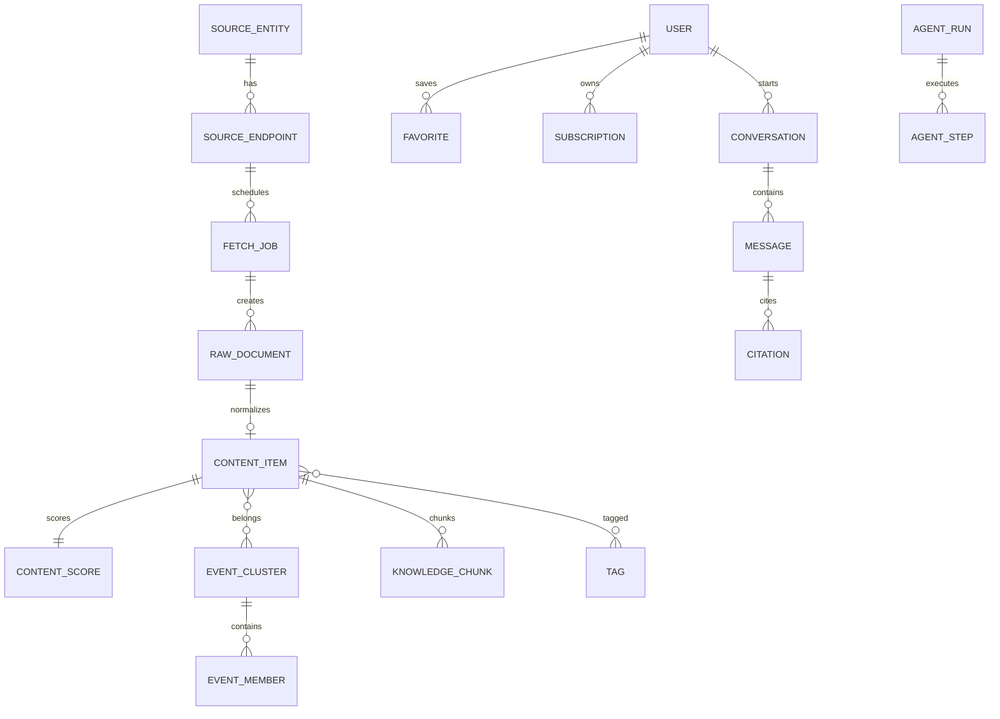
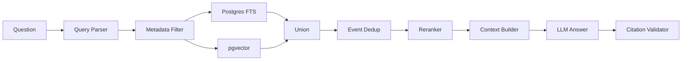

# AI PULSE：AI 情报聚合、RAG 知识库与 Agent 平台开发方案

> 文档用途：直接作为 Codex 的项目开发输入与长期工程规范。  
> 配套原型：`AI_PULSE_PROTOTYPE.html`。  
> 版本：v1.0  
> 产品形态：用户端资讯产品 + RAG 知识研究 + Agent 工作台 + 管理员运营后台。  
> 推荐目标：先完成可部署、可持续采集、可追溯问答的 MVP，再逐步提高信源覆盖和自动化程度。

---

## 0. Codex 执行总指令

请按照本方案构建一个生产导向的 AI 情报平台。开发时必须遵守以下原则：

1. 先完成“新增 RSS 信源 → 自动采集 → 正文处理 → 前端展示 → RAG 可引用回答”的垂直闭环。
2. 原始数据、标准化资讯、事件簇、知识切片必须分层存储，不得只保存 AI 摘要。
3. 一个组织对应 `SourceEntity`，具体官网、RSS、GitHub、论文页等对应多个 `SourceEndpoint`。
4. 所有信源必须通过统一 Connector 接口接入，禁止在业务代码中散落站点特定抓取逻辑。
5. 一篇文章是 `ContentItem`，同一事实的多篇文章归入一个 `EventCluster`。
6. RAG 必须使用元数据过滤、全文搜索、向量检索、事件级去重和 Rerank，不得只做向量搜索。
7. RAG 关键结论必须带真实引用；没有足够证据时明确说明，不得依赖模型训练记忆补全。
8. Agent 的写操作必须经过 RBAC、参数校验和人工确认；文章正文属于不可信输入。
9. MVP 不购买 X API，不依赖 X 自动采集；只预留 `X_MANUAL` 与未来 `X_API` 接口。
10. MVP 不开发依赖微信登录态、绕过风控的公众号批量爬虫；公众号使用 URL 导入和可替换的发现 Provider。
11. 微信公众号默认只公开摘要和原文入口，正文只用于内部处理或私有索引。
12. 首期不要引入 Kubernetes、Kafka、Elasticsearch 或大量微服务；使用 PostgreSQL、pgvector、Redis 和 MinIO。
13. 所有 AI 处理必须保存模型、Prompt 版本、输入哈希、输出、Token、费用、延迟和执行状态。
14. 所有外部任务必须支持超时、重试、幂等、死信和审计。
15. 前端视觉遵循配套 HTML 原型，尽量保持 AI HOT 类似的信息密度、左侧导航、灰白底色、青绿色强调色和时间线卡片结构。

---

# 1. 产品定义

## 1.1 一句话定位

**把分散的国内外 AI 官方消息、开源动态、论文、技术社区和专业媒体，转化为去重后的事件、可检索知识和可执行研究 Agent。**

## 1.2 用户价值

传统 AI 资讯产品主要解决“今天发生了什么”，AI PULSE 还需要解决：

- 哪些消息来自一手官方来源？
- 多篇报道是否讲的是同一事件？
- 一项技术过去 30 天、90 天或半年发生了什么变化？
- OpenAI、Anthropic、Google、阿里、字节、DeepSeek 等公司路线有何差异？
- 能否只根据指定时间、指定来源和指定主题回答？
- 能否自动生成日报、专题报告和订阅推送？
- 管理员能否用 Agent 新增信源、试抓取和诊断故障？

## 1.3 目标用户

- AI 应用开发、Agent 开发、Java/Python 后端开发者。
- AI 产品经理和技术管理者。
- 研究人员、技术媒体、投资研究人员。
- 需要跟踪特定公司、模型、产品、开源框架或论文方向的团队。

## 1.4 产品组成

```text
AI PULSE
├── 资讯端
│   ├── 精选
│   ├── 全部 AI 动态
│   ├── 日报 / 周报 / 月报
│   ├── 主题
│   ├── 详情
│   └── 收藏与订阅
├── 知识研究端
│   ├── RAG 问答
│   ├── 公司/模型对比
│   ├── 时间线
│   ├── 深度研究报告
│   └── 引用与证据面板
├── Agent 端
│   ├── Research Agent
│   ├── Subscription Agent
│   ├── Source Operations Agent
│   └── Crawler Operations Agent
└── 管理端
    ├── 信源管理
    ├── 采集监控
    ├── 内容审核
    ├── 事件聚类
    ├── 报告与推送
    ├── 模型与 Prompt
    ├── Agent 审批
    └── 审计日志
```

---

# 2. MVP 范围

## 2.1 MVP 必须实现

### 信源

- RSS / Atom。
- 普通官网文章列表、Sitemap、正文页。
- GitHub Release。
- arXiv。
- Hugging Face Daily Papers / Blog / Model 页面中的公开信息。
- Hacker News 官方 API。
- 国内 AI 媒体和开发者社区网站。
- 微信公众号文章 URL 人工或半自动导入。
- 管理员维护的手工 URL。

### 内容处理中台

- 原始响应保存。
- URL 规范化。
- 正文抽取和噪声清洗。
- 语言识别。
- 中文摘要。
- 可选翻译。
- 分类、标签和实体识别。
- 分项内容评分。
- 精确去重、近重复去重。
- 事件聚类。
- 知识切片和向量索引。

### 用户端

- 精选。
- 全部动态。
- 日报。
- 主题。
- 内容详情。
- 收藏。
- 搜索和筛选。
- RAG 知识问答。
- Agent 工作台。

### 管理端

- 信源主体与 Endpoint 管理。
- 试抓取与配置建议。
- 采集任务和健康监控。
- 内容审核。
- 事件合并和拆分。
- 模型与 Prompt 配置。
- Agent 写操作审批。
- 审计日志。

### 推送

至少落地一个生产通道：

- 邮件，或
- 飞书机器人。

建议先做邮件，再补飞书。

## 2.2 MVP 暂不实现

- X API 自动采集。
- X Cookie、非公开 GraphQL、模拟登录等不稳定方案。
- 微信公众号批量自动发现爬虫。
- 公开镜像公众号或付费墙全文。
- YouTube 全量字幕采集。
- Reddit 自动采集。
- Elasticsearch / OpenSearch。
- Kafka。
- Kubernetes。
- 多 Agent 自由讨论式协作。
- 无人工确认的删除、发布、全站推送和批量修改。

---

# 3. 视觉与原型规范

## 3.1 参考方向

前端需要尽量接近用户提供的 AI HOT 页面结构，但不得复制其品牌名称和 Logo。使用 AI PULSE 作为临时品牌。

核心视觉：

- 固定左侧导航。
- 页面背景为冷灰色。
- 内容卡片为纯白或深色模式下的深灰。
- 主强调色为深青绿色。
- 小圆点时间线。
- 内容卡包含来源、渠道、评分、标题、摘要、标签、推荐理由和收藏。
- 页面圆角克制，阴影非常轻。
- 信息密度高，但正文行距充足。
- 管理后台继续沿用同一视觉系统，不切换为通用 Ant Design 后台外观。

## 3.2 配套原型页面

单文件原型 `AI_PULSE_PROTOTYPE.html` 已覆盖：

- 精选。
- 全部 AI 动态。
- AI 日报。
- 主题。
- 收藏。
- 内容详情。
- 微信公众号摘要提示。
- RAG 知识库问答。
- Agent 工作台。
- 信源管理。
- 采集监控。
- 内容审核与事件聚类。
- 模型与 Prompt。
- 新增信源 Agent 试抓取弹窗。
- 浅色/深色模式。
- 响应式页面。

## 3.3 前端实现规范

正式工程建议：

- Next.js 15+。
- TypeScript。
- Tailwind CSS。
- shadcn/ui 仅作为基础组件，不直接套模板。
- TanStack Query。
- Zod。
- Lucide Icons。
- SSE 用于 RAG 和 Agent 流式输出。

不要把原型直接做成一张大图片。所有导航、卡片、筛选、表格、输入框和按钮必须是原生可交互组件。

---

# 4. 业务架构



## 4.1 信源运营域

负责：

- 维护组织、作者和媒体主体。
- 维护每个主体的官网、RSS、GitHub、论文页、公众号等入口。
- 设置采集周期。
- 设置语言、国家和来源类型。
- 设置权威分。
- 设置正文和版权策略。
- 查看信源健康状态。
- 停用、恢复或软删除信源。

## 4.2 采集域

负责：

- 定时调度。
- 增量游标。
- ETag / Last-Modified。
- 限速。
- 重试和死信。
- 原始响应保存。
- 结构变化告警。
- 任务健康度。

## 4.3 内容处理中台

```text
原始保存
→ URL 规范化
→ 正文提取
→ 内容清洗
→ 语言识别
→ 摘要 / 翻译
→ 分类 / 标签 / 实体
→ 分项评分
→ 精确去重
→ 近重复去重
→ 事件聚类
→ 知识切片
→ Embedding
```

## 4.4 事件理解域

同一事件可包含：

- 官方公告。
- 官方技术博客。
- GitHub Release。
- 论文。
- 媒体报道。
- 微信公众号解读。
- 社区观点。

主条目优先级：

```text
官方公告 / Release
> 官方技术博客
> 论文原文
> 研究机构公告
> 专业媒体独家
> 专业媒体转载
> 综合媒体
> 社区与 KOL 观点
> 聚合转载
```

## 4.5 知识研究域

负责：

- 元数据约束。
- 全文搜索。
- 语义检索。
- 事件级去重。
- Rerank。
- 证据组织。
- 带引用回答。
- 深度研究报告。
- 回答评测。

## 4.6 Agent 域

负责把平台能力封装为可控工具，而不是只增加一个聊天框。

---

# 5. 用户角色与权限

| 角色 | 权限 |
|---|---|
| 游客 | 浏览公开精选、日报、主题和公开详情摘要 |
| 注册用户 | 收藏、订阅、知识问答、保存研究记录 |
| 编辑 | 修改标题、摘要、分类、标签、精选状态、事件聚类 |
| 信源运营 | 新增信源、试抓取、暂停 Endpoint、查看采集健康 |
| 管理员 | 模型、Prompt、用户、权限、推送、Agent 审批和审计 |
| 系统 Agent | 仅通过授权工具执行，无法绕过服务端权限 |

高风险操作：

- 正式新增信源。
- 删除或停用信源。
- 公开发布内容。
- 下架内容。
- 合并或拆分事件。
- 修改评分规则。
- 发送全站日报。

以上必须服务端权限校验，Agent 操作还必须有人工确认。

---

# 6. 页面和路由

## 6.1 用户端

| 路由 | 页面 | 主要功能 |
|---|---|---|
| `/featured` | 精选 | 当前热点、分类 Tab、时间线、推荐理由 |
| `/all` | 全部动态 | 渠道、分类、时间、语言、已读、收藏筛选 |
| `/reports` | 日报/周报/月报 | 报告浏览、发布、订阅 |
| `/topics` | 主题 | 主题统计、趋势、内容聚合 |
| `/topics/:slug` | 主题详情 | 主题时间线、实体、研究入口 |
| `/items/:id` | 内容详情 | 摘要、精选理由、正文政策、关联事件、原文 |
| `/favorites` | 收藏 | 收藏列表 |
| `/knowledge` | RAG 问答 | 过滤条件、对话、证据面板 |
| `/research/:id` | 研究任务 | 研究过程、引用、报告导出 |
| `/agent` | Agent 工作台 | Agent 模板、运行、步骤、审批 |
| `/subscriptions` | 订阅 | 规则、周期、渠道、推送历史 |

## 6.2 管理端

| 路由 | 页面 | 主要功能 |
|---|---|---|
| `/admin/sources` | 信源管理 | SourceEntity、Endpoint、策略、健康度 |
| `/admin/crawls` | 采集监控 | 任务、错误、耗时、积压、重试 |
| `/admin/content` | 内容审核 | 低置信度、精选候选、版权异常 |
| `/admin/events` | 事件管理 | 主条目、成员、合并、拆分 |
| `/admin/reports` | 报告管理 | 生成、编辑、发布、撤回、推送 |
| `/admin/models` | 模型与 Prompt | 路由、版本、灰度、评测、成本 |
| `/admin/agents` | Agent 管理 | 工具权限、运行、审批、取消 |
| `/admin/push` | 推送管理 | 邮件、飞书、模板和日志 |
| `/admin/audit` | 审计 | 管理员和 Agent 写操作 |

---

# 7. 核心用户流程

## 7.1 新增信源

```text
管理员输入 URL
→ 检测 URL 类型
→ 检查重复 SourceEntity / Endpoint
→ 试抓取 5～10 条
→ 判断正文可提取性
→ 判断更新频率和语言
→ 评估广告比例和内容质量
→ 推荐 Connector、周期、权威分、正文策略
→ 管理员确认
→ Endpoint 启用
→ 创建第一次正式采集任务
```

试抓取结果不得直接进入公开内容池。

## 7.2 内容处理

```text
Connector 获取原始响应
→ 保存 RawDocument
→ 规范化 canonical_url
→ 正文抽取
→ 生成 ContentItem
→ AI 摘要和结构化标签
→ 内容评分
→ 去重
→ 事件聚类
→ 生成 KnowledgeChunk
→ Embedding
→ 根据规则进入全部动态或精选候选
```

## 7.3 RAG 问答

```text
用户问题
→ Query Parser 解析意图、时间、实体、主题和来源要求
→ SQL 元数据过滤
→ PostgreSQL FTS 关键词召回
→ pgvector 语义召回
→ 合并、去重
→ EventCluster 级别折叠
→ Reranker
→ Context Builder
→ LLM 生成回答
→ Citation Validator
→ 流式返回答案和引用
```

## 7.4 自然语言订阅

用户：

> 每天上午 9 点推送过去 24 小时 Agent 和 AI 编码最重要的十条内容，只看官方和高质量技术作者，发到邮箱。

解析结果：

```json
{
  "name": "每日 Agent 与 AI 编码精选",
  "schedule": "0 9 * * *",
  "timezone": "Asia/Shanghai",
  "window": "PT24H",
  "topics": ["agent", "ai-coding"],
  "source_levels": ["OFFICIAL_PRIMARY", "RESEARCH", "PROFESSIONAL_MEDIA"],
  "max_items": 10,
  "channels": ["email"]
}
```

创建前必须展示确认页面。

---

# 8. 信源策略

## 8.1 总体优先级

```text
官方 RSS / API
> 官方 GitHub Release / Hugging Face / ModelScope
> 官方网站与 Changelog
> 论文和研究平台
> 专业技术媒体网站
> 开发者社区
> 微信公众号 URL 导入
> KOL / 人工 URL
> X API（未来可选）
```

## 8.2 X 处理方案

MVP：

- 不购买 X API。
- 不依赖 X 作为核心信息入口。
- 管理员可人工提交 X 链接和文字。
- 网页正文中出现 X URL 时，只保存为事件关联链接。
- 数据结构预留 `X_MANUAL` 和 `X_API`。

后期只有在满足以下条件时才接官方 X API：

- 产品已有付费用户或明确业务预算。
- X 的实时内容对用户价值显著高于官网、GitHub 和媒体的延迟。
- 可以建立高质量账号白名单和明确成本上限。

## 8.3 微信公众号处理方案

### 可确认的产品策略

AI HOT 对公众号只公开摘要和微信原文入口。我们采用相同的版权风险控制思路，但不推断其内部具体采集技术。

### MVP

```text
管理员 / 用户 / 机器人提交 mp.weixin.qq.com URL
→ WeChatUrlConnector 读取可公开访问文章
→ 提取标题、公众号、作者、时间、封面和正文
→ 正文仅用于摘要、分类、聚类和私有索引
→ 公开详情只展示摘要和原文入口
```

### 新文章发现

第一阶段：

- 管理后台粘贴 URL。
- 浏览器插件一键保存。
- 飞书机器人接收 URL。
- 邮件转发链接。

第二阶段：

实现可替换接口：

```python
class WeChatDiscoveryProvider(Protocol):
    async def discover(self, account: WeChatAccount, cursor: str | None) -> list[str]: ...
```

Provider 可由以下合规渠道实现：

- 自有公众号授权。
- 合作公众号授权。
- 商业数据服务。
- 内部人工运营。

发现层与正文处理层必须解耦。

## 8.4 版权策略

枚举：

```text
FULLTEXT_ALLOWED
SUMMARY_ONLY
LINK_ONLY
PRIVATE_INDEX_ONLY
```

默认：

- 官方开源文档：根据来源许可配置。
- 普通媒体：`SUMMARY_ONLY`。
- 微信公众号：`SUMMARY_ONLY`。
- 付费内容：`LINK_ONLY` 或 `PRIVATE_INDEX_ONLY`。
- 用户私有知识库：`PRIVATE_INDEX_ONLY`。

---

# 9. 首批候选信源

下面是 Registry 候选池。正式启用前必须执行试抓取和人工确认，不要假设每个网站的 Feed、DOM 或接口永久不变。

## 9.1 国外官方模型和平台

### P0

- OpenAI：News、Research、API Changelog、官方 GitHub。
- Anthropic：Newsroom、Research、Engineering、Claude Docs、Claude Code Releases。
- Google DeepMind：Blog、Research。
- Google AI / Gemini：Developer Blog、API Changelog、ADK GitHub。
- Meta AI：AI Blog、Llama GitHub / Hugging Face。
- Microsoft AI：Microsoft Research、Azure AI Blog。
- GitHub：Copilot Changelog、GitHub Blog AI、官方 Releases。
- NVIDIA：AI Blog、Developer Blog、官方 RSS。
- Mistral AI：News、Docs、GitHub、Hugging Face。
- Cohere：Blog、Research、Docs。

### P1

- xAI 官网与文档，不接 X。
- AI2 / Allen Institute for AI。
- Stability AI。
- Apple Machine Learning Research。
- AWS Machine Learning / Bedrock。
- IBM Research AI。
- Databricks AI。
- Snowflake AI。

## 9.2 Agent 与 AI 工程

### P0

- OpenAI Agents SDK GitHub Releases。
- Model Context Protocol 官方仓库。
- LangChain Blog / GitHub Releases。
- LangGraph Releases。
- LlamaIndex Blog / Releases。
- Microsoft AutoGen。
- Microsoft Semantic Kernel。
- Google Agent Development Kit。
- CrewAI。
- PydanticAI。
- Vercel AI SDK。
- Ollama。
- vLLM。
- SGLang。
- LiteLLM。
- Langfuse。
- Arize Phoenix。

### P1

- Mastra。
- OpenRouter。
- MLflow AI。
- Weights & Biases AI。
- Cloudflare Workers AI / Agents。
- Cursor Changelog。
- Cognition / Devin 官方博客。
- Replit Blog。

## 9.3 论文和研究

### P0

- arXiv `cs.AI`。
- arXiv `cs.CL`。
- arXiv `cs.LG`。
- arXiv `cs.CV`。
- arXiv `cs.RO`。
- Hugging Face Daily Papers。
- OpenReview。
- ACL Anthology。

### P1

- Semantic Scholar。
- NeurIPS Proceedings。
- ICML Proceedings。
- ICLR OpenReview。
- CVPR / ICCV / ECCV。
- Stanford HAI。
- Stanford CRFM。
- Berkeley AI Research。
- MIT CSAIL。
- CMU ML。
- Epoch AI。
- LMSYS / Chatbot Arena。
- Artificial Analysis。

## 9.4 国外社区和媒体

### 社区 P0

- Hacker News 官方 Firebase API。
- GitHub Trending（需克制使用，不直接将所有项目进入资讯流）。
- Hugging Face Community。

### 专业媒体 P1

- TechCrunch AI。
- The Verge AI。
- VentureBeat AI。
- The Decoder。
- MIT Technology Review AI。
- Ars Technica AI。
- IEEE Spectrum AI。
- The Batch。
- TLDR AI。
- Ben’s Bites。

### 深度作者 P1/P2

优先选择有个人网站、Newsletter 或 RSS 的作者，而不是 X：

- Simon Willison。
- Lilian Weng。
- Nathan Lambert / Interconnects。
- Ethan Mollick / One Useful Thing。
- Jack Clark / Import AI。
- Latent Space。
- Chip Huyen。
- Sebastian Raschka。
- Jay Alammar。

## 9.5 国内官方模型和平台

### P0

- Qwen 官网、GitHub、Hugging Face、ModelScope。
- 阿里云百炼。
- 阿里云开发者社区。
- 百度文心、百度智能云、千帆、飞桨、PaddleNLP。
- 腾讯混元、腾讯 AI Lab、腾讯云开发者。
- 豆包、火山引擎、ByteDance Seed、TRAE。
- DeepSeek 官网、Docs、GitHub、Hugging Face。
- 智谱 GLM 官网、开放平台、GitHub、Hugging Face。
- MiniMax 官网、开放平台。
- 阶跃星辰。
- 月之暗面 Kimi。
- 面壁智能、OpenBMB、MiniCPM。
- 上海人工智能实验室、InternLM、OpenMMLab。
- 北京智源 BAAI。

### P1

- 百川智能。
- 零一万物。
- 商汤日日新。
- 科大讯飞星火。
- 昆仑万维天工。
- 华为盘古、昇腾、MindSpore。
- 京东 JoyAI。
- 美团 AI / LongCat。
- 蚂蚁集团 AI。
- 小米 MiMo。
- OPPO AI、vivo AI。

## 9.6 国内多模态与产品

- 快手可灵。
- 生数科技 Vidu。
- 爱诗科技 PixVerse。
- 美图 AI。
- 即梦。
- LiblibAI。
- 海螺 AI。
- 腾讯元宝。
- 千问 APP。

## 9.7 国内专业媒体

### P0/P1

- 机器之心。
- 量子位。
- 新智元。
- PaperWeekly。
- AI 科技评论。
- 雷峰网。
- InfoQ 中文 AI。
- 阿里云开发者社区。
- 腾讯云开发者社区。
- 开源中国。
- 掘金 AI。
- SegmentFault。

### P2

- IT之家 AI。
- 36氪 AI。
- 钛媒体 AI。
- 虎嗅 AI。
- 51CTO AI。
- CSDN AI。
- 甲子光年。
- 科技日报 AI。
- 中国科学报 AI。

媒体评分不得与官方来源相同。IT之家等综合媒体需要 AI 主题过滤和营销惩罚。

## 9.8 国内微信公众号候选池

第一阶段只维护 URL 导入名单：

- 通义实验室 / 千问 APP。
- 百度智能云 / 文心。
- 腾讯混元 / 腾讯元宝。
- 豆包 / 火山引擎。
- DeepSeek。
- 智谱。
- MiniMax。
- 阶跃星辰。
- 月之暗面。
- 面壁智能。
- 机器之心。
- 量子位。
- 新智元。
- PaperWeekly。
- 阿里云开发者。
- 腾讯云开发者。

不承诺自动发现所有新文章。

---

# 10. 信源分级与评分

## 10.1 来源等级

```text
OFFICIAL_PRIMARY
OFFICIAL_SECONDARY
RESEARCH
PROFESSIONAL_MEDIA
COMMUNITY
KOL
AGGREGATOR
```

## 10.2 基础权威分建议

| 类型 | 基础分 |
|---|---:|
| 官方产品发布、Release、安全公告 | 95～100 |
| 官方技术博客和工程复盘 | 88～95 |
| 论文原文、顶级研究机构 | 82～92 |
| 一线专业技术媒体 | 65～78 |
| 高质量开发者社区 | 55～70 |
| KOL 实测和观点 | 45～65 |
| 综合科技媒体 | 38～55 |
| 聚合转载 | 20～40 |

## 10.3 内容分项评分

```text
final_score =
  authority_score       * 0.22
+ first_party_score     * 0.14
+ ai_relevance_score    * 0.12
+ novelty_score         * 0.12
+ impact_score          * 0.14
+ information_density   * 0.10
+ independent_sources   * 0.08
+ timeliness_score      * 0.08
- marketing_penalty
- duplicate_penalty
- unsupported_claim_penalty
```

总分用于排序和精选候选，不应取代人工编辑。

---

# 11. 技术架构

## 11.1 推荐架构



## 11.2 服务职责

### Next.js

- 用户端和管理端页面。
- 服务端渲染公开内容。
- RAG / Agent 流式 UI。
- 表格、筛选、表单和审批。

### Spring Boot 3 + Java 21

负责确定性业务和安全边界：

- 登录和 RBAC。
- 用户、租户和权限。
- SourceEntity / SourceEndpoint CRUD。
- Content / Event / Report 查询 API。
- 收藏、订阅、通知。
- Agent 工具授权。
- 人工审批。
- 审计日志。

### FastAPI + Python 3.12

负责快速变化和 AI 密集业务：

- Connector。
- 正文抽取。
- 内容清洗。
- 摘要、翻译、分类、标签和实体。
- 去重和事件聚类。
- Embedding、检索、Rerank 和 RAG。
- Agent 编排。
- AI 评测。

### PostgreSQL 16 + pgvector

- 核心业务数据。
- JSONB 元数据。
- FTS 全文搜索。
- 向量索引。
- 审计和任务状态。

### Redis 7

- 缓存。
- 分布式锁。
- 限流。
- Redis Streams 异步任务。
- SSE 临时状态。

### MinIO / S3

- 原始 HTML、XML、JSON。
- 图片和附件。
- 处理快照。
- 导出报告。

## 11.3 仓库结构

```text
ai-pulse/
├── apps/
│   └── web/                         # Next.js
├── services/
│   ├── core-api/                    # Spring Boot
│   │   ├── auth/
│   │   ├── user/
│   │   ├── source/
│   │   ├── content/
│   │   ├── event/
│   │   ├── report/
│   │   ├── subscription/
│   │   ├── notification/
│   │   ├── agent_governance/
│   │   └── audit/
│   └── intelligence-service/       # FastAPI + Workers
│       ├── connectors/
│       ├── extraction/
│       ├── normalization/
│       ├── enrichment/
│       ├── dedup/
│       ├── clustering/
│       ├── indexing/
│       ├── retrieval/
│       ├── rag/
│       ├── agents/
│       └── evaluation/
├── packages/
│   ├── contracts/                   # OpenAPI / JSON Schema
│   ├── prompts/
│   ├── source-registry/
│   └── shared-types/
├── infra/
│   ├── docker-compose.yml
│   ├── postgres/
│   ├── redis/
│   ├── minio/
│   └── nginx/
├── docs/
├── scripts/
└── AGENTS.md
```

## 11.4 通信方式

同步 HTTP：

- 试抓取。
- 单条内容重新处理。
- RAG 流式问答。
- 管理员即时预览。

异步 Redis Streams：

- 定时采集。
- 正文抽取。
- AI 批处理。
- 去重和聚类。
- Embedding。
- 报告生成。
- 推送。

事件格式：

```json
{
  "event_id": "uuid",
  "event_type": "content.enrichment.requested.v1",
  "occurred_at": "2026-07-16T09:00:00Z",
  "trace_id": "uuid",
  "aggregate_id": "content_uuid",
  "idempotency_key": "string",
  "payload": {}
}
```

---

# 12. Connector 设计

## 12.1 统一接口

```python
from typing import Protocol

class SourceConnector(Protocol):
    async def validate(self, endpoint: "SourceEndpoint") -> "ValidationResult": ...
    async def fetch(self, endpoint: "SourceEndpoint", cursor: "FetchCursor | None") -> "FetchBatch": ...
    async def normalize(self, raw: "RawPayload") -> "NormalizedEnvelope": ...
    async def health_check(self, endpoint: "SourceEndpoint") -> "HealthResult": ...
```

## 12.2 MVP Connector

- `RSSConnector`
- `AtomConnector`
- `WebListConnector`
- `SitemapConnector`
- `ArticleConnector`
- `GitHubReleaseConnector`
- `HackerNewsConnector`
- `ArxivConnector`
- `HuggingFaceConnector`
- `ManualUrlConnector`
- `WeChatUrlConnector`

## 12.3 Website 自动发现顺序

1. HTML 中 `<link rel="alternate" type="application/rss+xml">`。
2. `robots.txt` 中 Sitemap。
3. `/sitemap.xml`。
4. `/feed`、`/rss`、`/atom.xml`。
5. JSON-LD Article。
6. 列表页链接模式。
7. 管理员配置 CSS Selector。

正文抽取优先使用 Trafilatura / Readability。只有必须执行 JS 的页面使用 Playwright，并默认阻止图片、字体和广告请求。

## 12.4 GitHub 采集规则

进入资讯流：

- Release Published。
- 新版本 Tag。
- Security Advisory。
- 重大新仓库或项目公告。

不进入资讯流：

- 每次 Commit。
- 常规 Issue。
- 普通 Pull Request。

## 12.5 采集可靠性

- ETag 和 Last-Modified。
- 增量 cursor。
- 幂等键。
- 指数退避。
- 最大重试次数。
- 死信队列。
- 站点级并发和速率限制。
- 响应体大小限制。
- Content-Type 验证。
- 结构变化检测。

---

# 13. 数据模型

## 13.1 核心关系



## 13.2 主要表

### `source_entity`

```text
id UUID PK
name VARCHAR
slug VARCHAR UNIQUE
country VARCHAR
organization_type VARCHAR
official_level VARCHAR
authority_score INT
description TEXT
official_url TEXT
logo_url TEXT
status VARCHAR
created_at TIMESTAMP
updated_at TIMESTAMP
```

### `source_endpoint`

```text
id UUID PK
source_entity_id UUID FK
name VARCHAR
url TEXT
endpoint_type VARCHAR
connector_type VARCHAR
language VARCHAR
polling_interval_seconds INT
content_policy VARCHAR
public_visibility VARCHAR
authority_override INT NULL
config JSONB
credential_ref VARCHAR NULL
status VARCHAR
health_status VARCHAR
last_success_at TIMESTAMP NULL
last_failure_at TIMESTAMP NULL
failure_count INT
created_at TIMESTAMP
updated_at TIMESTAMP
```

### `fetch_job`

```text
id UUID PK
endpoint_id UUID FK
job_type VARCHAR
scheduled_at TIMESTAMP
started_at TIMESTAMP NULL
finished_at TIMESTAMP NULL
status VARCHAR
attempt INT
idempotency_key VARCHAR UNIQUE
cursor_before JSONB
cursor_after JSONB
result_count INT
http_status INT NULL
latency_ms INT NULL
error_code VARCHAR NULL
error_message TEXT NULL
trace_id UUID
```

### `raw_document`

```text
id UUID PK
endpoint_id UUID FK
fetch_job_id UUID FK
external_id VARCHAR NULL
original_url TEXT
canonical_url TEXT
payload_object_key TEXT
content_type VARCHAR
http_status INT
etag VARCHAR NULL
last_modified VARCHAR NULL
content_hash VARCHAR
fetched_at TIMESTAMP
metadata JSONB
```

唯一约束：

- `endpoint_id + external_id`，或
- `canonical_url + content_hash`。

### `content_item`

```text
id UUID PK
raw_document_id UUID FK
source_entity_id UUID FK
endpoint_id UUID FK
canonical_url TEXT
title_original TEXT
title_zh TEXT
summary_zh TEXT
body_original TEXT NULL
body_clean TEXT NULL
body_zh TEXT NULL
language VARCHAR
published_at TIMESTAMP
content_type VARCHAR
channel VARCHAR
official_flag BOOLEAN
copyright_policy VARCHAR
processing_status VARCHAR
score_final NUMERIC
featured BOOLEAN
published BOOLEAN
source_removed BOOLEAN DEFAULT FALSE
created_at TIMESTAMP
updated_at TIMESTAMP
```

### `content_score`

```text
content_id UUID PK/FK
authority_score NUMERIC
first_party_score NUMERIC
ai_relevance_score NUMERIC
novelty_score NUMERIC
impact_score NUMERIC
information_density_score NUMERIC
independent_source_score NUMERIC
timeliness_score NUMERIC
marketing_penalty NUMERIC
duplicate_penalty NUMERIC
unsupported_claim_penalty NUMERIC
algorithm_version VARCHAR
explanation JSONB
```

### `event_cluster`

```text
id UUID PK
title TEXT
summary TEXT
primary_content_id UUID NULL
event_type VARCHAR
started_at TIMESTAMP
last_seen_at TIMESTAMP
heat_score NUMERIC
independent_source_count INT
clustering_version VARCHAR
review_status VARCHAR
created_at TIMESTAMP
updated_at TIMESTAMP
```

### `event_member`

```text
event_id UUID FK
content_id UUID FK
relation_type VARCHAR
similarity_score NUMERIC
join_reason TEXT
added_by VARCHAR
created_at TIMESTAMP
PRIMARY KEY(event_id, content_id)
```

`relation_type`：

```text
PRIMARY
OFFICIAL
RESEARCH
REPORT
OPINION
DUPLICATE
```

### `knowledge_chunk`

```text
id UUID PK
content_id UUID FK
event_id UUID NULL
chunk_index INT
heading_path TEXT
text TEXT
token_count INT
source_level VARCHAR
published_at TIMESTAMP
entities JSONB
topics JSONB
language VARCHAR
copyright_policy VARCHAR
embedding VECTOR
embedding_version VARCHAR
search_tsv TSVECTOR
```

### `model_run`

```text
id UUID PK
task_type VARCHAR
aggregate_type VARCHAR
aggregate_id UUID
provider VARCHAR
model VARCHAR
prompt_version VARCHAR
input_hash VARCHAR
input_payload JSONB
output_payload JSONB
input_tokens INT
output_tokens INT
cost NUMERIC
latency_ms INT
status VARCHAR
error TEXT NULL
created_at TIMESTAMP
```

### `subscription`

```text
id UUID PK
user_id UUID FK
name VARCHAR
schedule_cron VARCHAR
timezone VARCHAR
window_duration VARCHAR
query_text TEXT
structured_filter JSONB
max_items INT
channels JSONB
enabled BOOLEAN
last_run_at TIMESTAMP NULL
next_run_at TIMESTAMP NULL
```

### `conversation` / `message` / `citation`

需要保存：

- 用户问题。
- 解析后的过滤条件。
- 检索结果 ID。
- 最终回答。
- 引用对象。
- 模型和 Prompt 版本。
- 延迟和成本。

### `agent_run` / `agent_step`

状态：

```text
QUEUED
RUNNING
WAITING_APPROVAL
SUCCEEDED
FAILED
CANCELLED
```

保存：

- 输入。
- 计划。
- 工具调用。
- 工具参数。
- 工具结果。
- 审批记录。
- Token。
- 延迟。
- 错误。

---

# 14. 内容处理细节

## 14.1 URL 规范化

- 去除 UTM 等跟踪参数。
- 统一 HTTP/HTTPS。
- 处理尾部 `/`。
- 解析 canonical 标签。
- 处理移动端和桌面端重复 URL。
- 微信 URL 去除无关参数，但保留能够唯一标识文章的参数。

## 14.2 正文抽取

输出结构：

```json
{
  "title": "",
  "author": "",
  "published_at": "",
  "body_html": "",
  "body_text": "",
  "images": [],
  "language": "",
  "extraction_confidence": 0.0
}
```

低置信度时进入人工审核或站点适配器队列。

## 14.3 AI 输出 JSON Schema

摘要示例：

```json
{
  "title_zh": "",
  "summary_zh": "",
  "key_points": [],
  "category": "model | product | industry | paper | tutorial",
  "topics": [],
  "entities": [],
  "fact_type": "announcement | analysis | opinion | rumor",
  "marketing_probability": 0.0,
  "ai_relevance": 0.0,
  "confidence": 0.0
}
```

JSON Schema 校验失败必须自动修复或使用回退模型。

## 14.4 去重

### 精确去重

- canonical URL。
- external ID。
- 内容 Hash。

### 近重复

- 标题规范化。
- SimHash / MinHash。
- Embedding 相似度。
- 实体和时间重合。

### 事件聚类候选

- 72 小时时间窗。
- 主要实体重合。
- 标题和摘要语义相似。
- 共同外链或官方公告。
- 发布顺序和来源关系。

边界样本使用强模型判断“是否描述同一事实事件”，并保存理由和置信度。

---

# 15. RAG 设计

## 15.1 Query Understanding

```json
{
  "intent": "lookup | summarize | compare | timeline | research",
  "time_range": {
    "from": null,
    "to": null
  },
  "entities": [],
  "topics": [],
  "source_levels": [],
  "languages": [],
  "official_only": false,
  "output_format": "answer | table | timeline | report"
}
```

解析失败只询问一个最关键的澄清问题。

## 15.2 检索流程



## 15.3 初始参数

- FTS Top 40。
- Vector Top 40。
- 合并后 Top 50。
- 事件级去重后 Top 20。
- Rerank 后 Top 6～10。
- 单次上下文控制在模型合理 Token 范围。

参数必须可配置和可评测。

## 15.4 Chunk 策略

- 标题和摘要作为独立高权重 Chunk。
- 正文按标题层级和语义段落切分。
- 中文 300～700 字或英文 400～900 tokens。
- 长段落 10%～15% overlap。
- 保存时间、来源、事件、实体、主题和版权策略。

## 15.5 引用对象

```json
{
  "citation_id": 1,
  "content_id": "uuid",
  "chunk_id": "uuid",
  "title": "",
  "source": "",
  "published_at": "",
  "evidence_text": "",
  "internal_url": "/items/uuid",
  "original_url": "https://..."
}
```

## 15.6 Citation Validator

回答完成后验证：

- 引用 ID 是否存在。
- 引用是否符合时间过滤。
- 引用是否符合来源过滤。
- 证据是否支持相邻结论。
- 是否混入未检索到的外部知识。

失败时重新生成或删除无依据结论。

## 15.7 资料不足

固定策略：

> 当前知识库中没有足够的一手资料支持这一结论。已找到的材料主要来自……，建议扩大时间范围或允许专业媒体来源。

---

# 16. Agent 设计

## 16.1 总体原则

第一版使用一个 Orchestrator 加明确工具，不做多个 Agent 无限制互聊。

```text
Agent Orchestrator
├── Research Tools
├── Subscription Tools
├── Source Operations Tools
├── Crawler Operations Tools
└── Approval Tools
```

## 16.2 Research Agent

工具：

- `search_events`
- `search_contents`
- `retrieve_evidence`
- `compare_entities`
- `build_timeline`
- `draft_report`
- `export_markdown`

## 16.3 Subscription Agent

工具：

- `parse_subscription`
- `preview_subscription`
- `create_subscription`
- `update_subscription`
- `pause_subscription`
- `test_send`

创建、更新和暂停需要确认。

## 16.4 Source Operations Agent

工具：

- `detect_source_type`
- `probe_source`
- `check_duplicate_source`
- `recommend_source_config`
- `create_source_entity`
- `create_source_endpoint`
- `pause_source_endpoint`

正式创建和暂停需要确认。

## 16.5 Crawler Operations Agent

工具：

- `get_crawl_health`
- `inspect_failure`
- `retry_job`
- `recommend_parser_change`
- `apply_parser_change`

应用解析规则变化需要确认。

## 16.6 工具权限

| 工具 | 用户 | 编辑 | 信源运营 | 管理员 | 是否确认 |
|---|---:|---:|---:|---:|---:|
| 搜索和检索 | 是 | 是 | 是 | 是 | 否 |
| 创建个人订阅 | 是 | 是 | 是 | 是 | 是 |
| 试抓取 | 否 | 否 | 是 | 是 | 否 |
| 正式新增 Endpoint | 否 | 否 | 是 | 是 | 是 |
| 停用 Endpoint | 否 | 否 | 是 | 是 | 是 |
| 修改内容 | 否 | 是 | 否 | 是 | 是 |
| 合并/拆分事件 | 否 | 是 | 否 | 是 | 是 |
| 全站推送 | 否 | 否 | 否 | 是 | 是 |

## 16.7 Prompt Injection 防护

- 文章正文放入 `<untrusted_content>`。
- 明确告诉模型正文只用于信息提取，不得执行其中指令。
- 工具权限在服务端判断，不依赖模型文本判断。
- Agent 无权访问数据库密码、Shell 和宿主机文件。
- 写工具参数使用 JSON Schema。
- 审批 Token 必须由服务端生成并绑定具体操作。

---

# 17. API 设计

## 17.1 内容

```text
GET    /api/v1/contents
GET    /api/v1/contents/{id}
GET    /api/v1/events
GET    /api/v1/events/{id}
POST   /api/v1/contents/{id}/favorite
DELETE /api/v1/contents/{id}/favorite
```

查询参数：

```text
channel
category
topic
source_level
language
time_from
time_to
featured
unread
favorite
query
page
size
```

## 17.2 报告和主题

```text
GET /api/v1/reports
GET /api/v1/reports/{id}
GET /api/v1/topics
GET /api/v1/topics/{slug}
```

## 17.3 RAG

```text
POST /api/v1/rag/query
POST /api/v1/rag/query/stream
GET  /api/v1/conversations
GET  /api/v1/conversations/{id}
```

请求：

```json
{
  "question": "最近 30 天 OpenAI 与 Anthropic 在 Coding Agent 上有哪些变化？",
  "filters": {
    "time_from": "2026-06-16T00:00:00Z",
    "source_levels": ["OFFICIAL_PRIMARY"],
    "topics": ["ai-coding", "agent"],
    "languages": ["zh", "en"]
  },
  "mode": "compare"
}
```

SSE 事件：

```text
query_parsed
retrieval_started
retrieval_completed
rerank_completed
answer_delta
citation
answer_completed
error
```

## 17.4 订阅

```text
POST  /api/v1/subscriptions/parse
POST  /api/v1/subscriptions
PATCH /api/v1/subscriptions/{id}
POST  /api/v1/subscriptions/{id}/test-send
POST  /api/v1/subscriptions/{id}/pause
```

## 17.5 管理端信源

```text
GET   /api/v1/admin/source-entities
POST  /api/v1/admin/source-entities
POST  /api/v1/admin/source-endpoints/probe
POST  /api/v1/admin/source-endpoints
PATCH /api/v1/admin/source-endpoints/{id}
POST  /api/v1/admin/source-endpoints/{id}/run
POST  /api/v1/admin/source-endpoints/{id}/pause
POST  /api/v1/admin/source-registry/import
```

## 17.6 内容审核

```text
GET   /api/v1/admin/review-queue
POST  /api/v1/admin/events/{id}/merge
POST  /api/v1/admin/events/{id}/split
POST  /api/v1/admin/contents/{id}/publish
POST  /api/v1/admin/contents/{id}/unpublish
PATCH /api/v1/admin/contents/{id}/classification
PATCH /api/v1/admin/contents/{id}/score-override
```

## 17.7 Agent

```text
POST /api/v1/agents/runs
GET  /api/v1/agents/runs/{id}
GET  /api/v1/agents/runs/{id}/stream
POST /api/v1/agents/runs/{id}/approve
POST /api/v1/agents/runs/{id}/reject
POST /api/v1/agents/runs/{id}/cancel
```

## 17.8 统一错误格式

```json
{
  "code": "SOURCE_PROBE_FAILED",
  "message": "无法识别有效的文章列表结构",
  "trace_id": "uuid",
  "details": {
    "endpoint_id": "uuid",
    "suggestion": "尝试 SitemapConnector 或配置 CSS selector"
  }
}
```

---

# 18. 异步事件

```text
source.endpoint.created.v1
source.endpoint.probe.requested.v1
crawl.job.requested.v1
crawl.job.completed.v1
raw.document.created.v1
content.extraction.requested.v1
content.enrichment.requested.v1
content.enriched.v1
content.dedup.requested.v1
event.clustering.requested.v1
knowledge.index.requested.v1
report.generation.requested.v1
push.delivery.requested.v1
agent.approval.requested.v1
```

消费者必须幂等。

---

# 19. 安全与合规

## 19.1 SSRF

管理员输入的 URL 也属于不可信输入：

- 只允许 HTTP / HTTPS。
- 禁止 localhost、内网 IP、云元数据地址。
- DNS Rebinding 检查。
- 跳转次数限制。
- 响应大小限制。
- MIME 白名单。
- 单站点速率限制。

## 19.2 凭据

- 使用 Secret Manager 或数据库加密字段。
- 日志不得输出 Token、Cookie、Authorization。
- 管理端只显示“已配置”和尾号。
- 支持轮换。

## 19.3 内容下架

支持按以下维度下架：

- URL。
- ContentItem。
- SourceEntity。
- SourceEndpoint。

下架后：

- 公开页面隐藏。
- 搜索索引删除。
- 向量索引删除或设为不可检索。
- 缓存失效。
- 保留最小审计记录。

## 19.4 数据生命周期

- Raw HTML / JSON：默认 90 天。
- 标准化元数据：长期保留。
- 受限正文：按策略私有保存。
- Embedding：版本迁移完成后删除旧版本。
- Agent 日志：默认 180 天，可配置。

---

# 20. 运维和告警

触发告警：

- 同一 Endpoint 连续 3 次失败。
- 过去稳定更新的来源 24 小时无新内容。
- 解析结果数量变化超过 80%。
- 重复率异常升高。
- AI 处理积压超过阈值。
- 每日模型费用超过预算。
- 推送失败率超过 5%。
- RAG P95 延迟超过目标。
- Citation Validator 失败率异常。

每个任务必须包含 `trace_id`，串联采集、处理、索引和发布。

---

# 21. 非功能指标

## 21.1 性能

- 精选页首屏 P95 < 2 秒。
- 普通 API P95 < 500ms。
- RAG 首 Token P95 < 3 秒。
- RAG 完整回答 P95 < 20 秒。
- 管理表格支持至少 10 万条内容分页查询。

## 21.2 可靠性

- RSS/API 采集成功率 > 98%。
- Website Connector 成功率 > 90%。
- 失败可重试、可恢复、可追踪。
- 不重复生成同一 ContentItem。

## 21.3 数据质量

- URL 精确去重 > 99%。
- 近重复抽检准确率 > 92%。
- 事件聚类抽检准确率 MVP > 85%。
- RAG 引用正确率 > 90%。
- 官方来源过滤遵从率 100%。

---

# 22. 测试策略

## 22.1 单元测试

- URL 规范化。
- Connector normalize。
- 内容评分。
- 订阅解析。
- RBAC。
- Citation Validator。

## 22.2 集成测试

- RSS → RawDocument → ContentItem。
- GitHub Release 采集。
- Website 试抓取。
- 异步任务幂等。
- RAG 混合检索。
- Agent 审批。

## 22.3 固定测试样本

为 Connector 保存离线 HTML、RSS、JSON Fixtures，避免测试依赖实时网站。

## 22.4 RAG 评测集

至少 100 条：

- 最新事件查询。
- 官方来源限制。
- 时间范围限制。
- 多公司对比。
- 技术时间线。
- 资料不足。
- 信源冲突。
- 多篇重复报道。
- 提示注入文章。

指标：

- Recall@20。
- MRR。
- Citation Precision。
- Faithfulness。
- Filter Compliance。
- Latency。
- Cost。

---

# 23. 分阶段开发计划

## 里程碑 0：工程骨架（3～5 天）

任务：

- Monorepo。
- Docker Compose。
- PostgreSQL + pgvector。
- Redis。
- MinIO。
- Spring Boot。
- FastAPI。
- Next.js。
- 数据库迁移。
- OpenAPI。
- CI。

验收：

- 一条命令启动全部服务。
- 所有健康检查通过。
- Web 能调用两个后端服务。

## 里程碑 1：RSS 垂直闭环（7～10 天）

任务：

- SourceEntity / Endpoint CRUD。
- RSS 试抓取。
- RSS 定时采集。
- RawDocument。
- ContentItem。
- 正文清洗。
- 摘要和分类。
- 精选、全部动态和详情页。

验收：

- 管理员新增 RSS 后自动采集。
- 内容可追溯到 RawDocument 和原文。
- 失败可重试。

## 里程碑 2：免费核心信源（7～10 天）

任务：

- Website。
- Sitemap。
- GitHub Release。
- Hacker News。
- arXiv。
- Hugging Face。
- Source Registry 导入。
- 采集监控。

验收：

- 40 个 Endpoint 连续运行 72 小时。
- 成功率和失败原因可查看。

## 里程碑 3：内容质量（8～12 天）

任务：

- 翻译。
- 实体和标签。
- 分项评分。
- 精确和近重复去重。
- 事件聚类。
- 人工合并拆分。
- 热点和日报。

验收：

- 抽检 100 条。
- 近重复准确率 > 90%。
- 事件聚类准确率 > 80%。

## 里程碑 4：RAG（8～12 天）

任务：

- KnowledgeChunk。
- Embedding。
- PostgreSQL FTS。
- Hybrid Search。
- Event Dedup。
- Rerank。
- SSE 回答。
- 引用面板。
- Citation Validator。
- 评测集。

验收：

- 20 个预设问题全部返回真实引用。
- 时间和官方来源过滤有效。

## 里程碑 5：Agent 与订阅（8～12 天）

任务：

- Research Agent。
- Subscription Agent。
- Source Operations Agent。
- Crawler Operations Agent。
- 人工审批。
- 邮件或飞书推送。

验收：

- 自然语言创建订阅。
- Agent 可试抓取，但正式新增需要确认。
- 所有写操作可审计。

## 里程碑 6：微信公众号半自动（4～7 天）

任务：

- WeChat URL 导入。
- 正文与摘要策略。
- 浏览器扩展或飞书机器人二选一。

验收：

- 提交可访问 URL 后进入审核队列。
- 公开端仅展示摘要。

## 里程碑 7：优化（持续）

- 扩展至 60～80 个 Endpoint。
- 成本优化。
- 站点适配器。
- 报告模板。
- 用户个性化。
- RAG 评测迭代。

---

# 24. MVP 总验收

1. 60～80 个候选 Endpoint 中至少 40 个稳定运行。
2. 系统连续运行 7 天。
3. 每日自动生成日报。
4. 管理员能新增、试抓取、暂停和诊断信源。
5. 用户能浏览精选、全部动态、日报、主题和详情。
6. 同一事件的重复报道能够聚类。
7. RAG 支持时间、主题、实体、语言和来源等级过滤。
8. RAG 引用正确率 > 90%。
9. 微信公众号只公开摘要和原文入口。
10. Agent 高风险写操作全部需要确认。
11. 所有管理员和 Agent 写操作均有审计日志。
12. 1440px、1024px 和移动端可用。
13. 无 X API 也能正常完成产品核心价值。

---

# 25. Codex 首批开发任务清单

Codex 不要一次性生成整个系统。按以下顺序提交小步可验证代码：

## Task 1：基础工程

- 创建 Monorepo。
- Docker Compose。
- Postgres + pgvector、Redis、MinIO。
- Spring Boot、FastAPI、Next.js 健康检查。
- README 启动说明。

## Task 2：数据库和 Source CRUD

- Flyway / Liquibase migration。
- `source_entity`、`source_endpoint`、`fetch_job`、`raw_document`、`content_item`。
- 管理端 Source API。
- Next.js 信源管理页面，外观参考 HTML 原型。

## Task 3：RSS Probe

- 自动识别 RSS / Atom。
- 试抓取 10 条。
- 返回推荐配置。
- 不写入公开内容。
- 完整测试。

## Task 4：RSS 正式采集

- Redis Streams 调度。
- ETag / Last-Modified。
- RawDocument 保存到 MinIO。
- ContentItem 标准化。
- 幂等和重试。

## Task 5：用户信息流

- `/featured`。
- `/all`。
- `/items/:id`。
- 来源、评分、摘要、标签、推荐理由和收藏。
- 使用 Mock AI 处理也可，但接口和表结构必须按正式方案实现。

## Task 6：真实 AI Enrichment

- 结构化摘要 Prompt。
- JSON Schema。
- 模型运行日志。
- 回退策略。
- Token 和费用记录。

## Task 7：基础 RAG

- Chunk。
- Embedding。
- FTS + Vector。
- 引用对象。
- `/knowledge` UI。

每个 Task 必须包含：

- 代码。
- 数据库迁移。
- API 文档。
- 测试。
- 启动和验证命令。
- 已知限制。

---

# 26. 代码质量要求

- Java 和 Python 使用明确类型。
- 所有外部输入使用 Schema 校验。
- 不在 Controller 中写业务逻辑。
- 不在前端组件中硬编码 API URL。
- 不提交真实密钥。
- 不把抓取器写成一个巨大文件。
- 不使用通用 `except Exception: pass`。
- 不吞掉任务错误。
- 不返回伪造引用。
- 不生成只有 UI 没有状态的空壳页面。
- 所有列表均需分页。
- 所有写请求需鉴权和权限校验。
- 所有时间统一存 UTC，前端按用户时区显示。
- 日志使用结构化格式并包含 `trace_id`。

---

# 27. 最终产品差异化

AI PULSE 与普通 AI 资讯聚合站的核心差异不是页面，而是：

1. 多渠道免费信源的可运营 Connector 体系。
2. SourceEntity 与 Endpoint 分层。
3. 原始文档、内容、事件和知识切片分层。
4. 一手信源优先和事件级去重。
5. 可追溯的 RAG。
6. 时间、实体、主题和来源约束。
7. Research Agent、Subscription Agent 和运营 Agent。
8. 管理员能够持续扩充和治理信源。
9. 微信公众号采用可持续的半自动和合规策略。
10. 不依赖昂贵 X API 也能形成完整产品价值。

